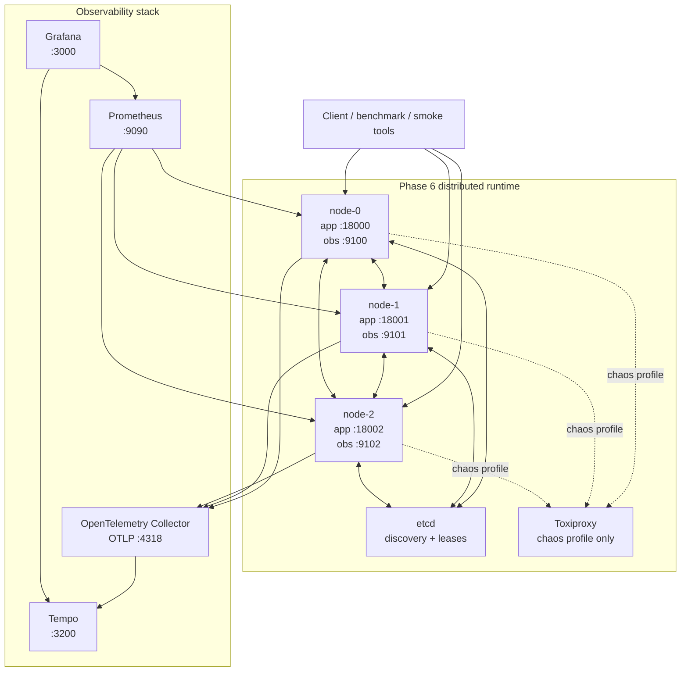

# Advanced Distributed System

**Correctness-first distributed infrastructure for reliable AI/ML services.**

A seven-phase distributed-systems engineering project that evolves from a bounded asynchronous execution engine into a secure, durable, observable, fault-tested multi-node platform.

**Current implementation:** Phase 6 · `v0.6.0`  
**Verified implementation checkpoint:** `296fdd8`  
**Next:** Phase 7 — production delivery, Kubernetes/cloud deployment, CI/release engineering, and portfolio hardening.

---

## Why this project exists

Production AI/ML systems depend on much more than model inference.

They also need infrastructure that can:

- isolate CPU-heavy work from the async event loop,
- bound overload instead of failing unpredictably,
- route work across multiple nodes,
- preserve causal context,
- converge replicated state,
- recover durable state after restart,
- authenticate peer nodes,
- survive coordination failures,
- expose useful telemetry,
- reproduce performance measurements,
- and prove recovery behavior under controlled faults.

This repository implements those concerns incrementally while keeping the system's guarantees explicit.

It is intentionally **not** presented as a consensus database or a linearizable distributed store.

---

## Phase 6 verification at a glance

The Phase 6 release gate completed successfully on 2026-09-15.

| Verification | Result |
| --- | --- |
| Full pytest suite | **373 passed, 8 skipped** |
| Ruff | **PASS** |
| Black | **PASS** |
| mypy | **PASS** |
| Python compile check | **PASS** |
| Direct three-node cluster | **PASS** |
| Prometheus targets | **3/3 healthy** |
| Grafana provisioning | **PASS** |
| Tempo trace round-trip | **PASS** |
| Task quick benchmark | **100% success** |
| CRDT quick benchmark | **100% success** |
| Network-delay chaos | **PASS + cleanup** |
| Network-partition chaos | **PASS + cleanup** |
| etcd-outage chaos | **PASS + recovery** |
| Container node-kill chaos | **PASS + recovery** |
| Final Phase 6 release gate | **PASS** |

See [`docs/PHASE6_VERIFICATION.md`](docs/PHASE6_VERIFICATION.md) for the complete evidence record.

---

## Architecture



Phase 6 intentionally has two network profiles:

```text
DIRECT / HEALTHY BASELINE
client
   │
   ├──► node-0
   ├──► node-1
   └──► node-2
             │
             └── peer RPCs use direct Docker service DNS

PROXY / CHAOS PROFILE
client
   │
   └──► node
          │
          ▼
      Toxiproxy
          │
          ▼
      peer node / etcd
```

Healthy benchmarks therefore do not pay chaos-proxy overhead. Fault experiments explicitly opt into proxy routing.

Detailed design: [`docs/PHASE6_ARCHITECTURE.md`](docs/PHASE6_ARCHITECTURE.md).

---

## What Phase 6 adds

### Observability

- Dedicated observability HTTP listeners separate from the application protocol.
- `/metrics`, `/health/live`, and `/health/ready`.
- Low-cardinality Prometheus instrumentation.
- OpenTelemetry spans with W3C trace-context propagation.
- OTLP export through the OpenTelemetry Collector.
- Tempo trace storage/query path.
- Provisioned Grafana data sources and dashboards.
- Telemetry failures stay off the correctness-critical data path.

### Deterministic chaos engineering

- Toxiproxy-managed network latency.
- Selective peer partition.
- etcd outage/restart.
- Managed Docker container node kill/restart.
- Explicit safety gate through `RUN_CHAOS_TESTS=1`.
- Managed proxy allow-list.
- Idempotent toxic cleanup.
- Recovery checks after every injected fault.
- Existing data-plane continuity checked during applicable degraded states.

### Reproducible performance checks

- Task and CRDT benchmark workloads.
- Fixed random seed.
- Environment metadata captured in every artifact.
- Latency p50/p95/p99.
- Throughput and success ratio.
- Correctness checks included with performance output.
- Quick local profile for regression detection.
- Formal profile available for longer reproducible experiments.

---

## Phase 6 verified benchmark snapshot

The final release gate used the **quick regression profile**:

```text
concurrency      8
warmup           1 second
measurement      5 seconds
payload          256 bytes
seed             6
```

### Task workload

```text
requests         1650
successes        1650
success ratio    1.000
throughput       ~329.87 req/s

p50              ~24.70 ms
p95              ~38.25 ms
p99              ~45.45 ms

correctness      PASS
valid            true
```

### CRDT workload

```text
requests         1663
successes        1663
success ratio    1.000
throughput       ~332.15 req/s

p50              ~22.33 ms
p95              ~41.82 ms
p99              ~51.43 ms

correctness      PASS
valid            true
```

These are **local regression measurements**, not universal production performance claims.

---

## Verified chaos behavior

### Network delay

```text
baseline peer RTT     ~7.46 ms
degraded peer RTT     ~783.25 ms
recovered peer RTT    ~6.55 ms

local data plane      healthy
cleanup               successful
scenario              PASS
```

### Network partition

```text
before fault          reachable
during fault          unreachable
after cleanup         reachable

local data plane      healthy
cleanup               successful
scenario              PASS
```

### etcd outage

```text
coordination before   node-0, node-1, node-2
during outage         node-0, node-2 observed healthy
after recovery        node-0, node-1, node-2

data plane            healthy
recovery              ~2.75 s
scenario              PASS
```

### Node kill

```text
ready before          node-0, node-1, node-2
during failure        node-0, node-2
after recovery        node-0, node-1, node-2

data plane            healthy
recovery              ~2.58 s
scenario              PASS
```

These tests demonstrate bounded degraded-mode behavior for the tested scenarios. They do not establish arbitrary fault tolerance or consensus guarantees.

---

## Core distributed-system guarantees

Phase 6 preserves the correctness boundaries established in Phases 1–5.

### Compute and resilience

- CPU-heavy work is isolated through bounded workers.
- Backpressure bounds admitted work.
- Rate limiting and deadlines are explicit.
- Retry/circuit-breaker primitives are applied to peer communication where appropriate.

### Cluster and routing

- Three-node asynchronous cluster.
- SWIM-lite membership and failure detection.
- Incarnation-aware membership.
- SHA-256 consistent hashing.
- Deterministic ownership/failover behavior.
- Single-hop forwarded task routing.

### Causal consistency and CRDTs

Implemented CRDTs:

- GCounter
- PNCounter
- ORSet
- MVRegister

Causal/session semantics include:

- dotted mutation identity,
- version vectors,
- causal tokens,
- read-your-writes,
- monotonic reads,
- monotonic writes,
- writes-follow-reads,
- targeted causal repair,
- replica-aware anti-entropy.

### Persistence and recovery

- SQLite WAL-backed local durable state.
- Schema versioning/migrations.
- Stable node installation UUID.
- Durable causal actor/counter/frontier.
- Persist-before-memory mutation path.
- Bounded persistence executor.
- SQLite online backup.
- Restart restore/reconciliation.
- Recovery readiness gating.

### Coordination and security

- etcd discovery and TTL leases.
- Coordination can degrade without automatically stopping the existing data plane.
- TLS 1.3 secure profile.
- Mutual TLS authentication.
- Logical node identity checked against certificate SANs.

---

## Durability semantics

A successful durable CRDT mutation means the **local node committed the mutation before acknowledging it**.

```text
causal validation
      │
      ▼
persistence admission
      │
      ▼
replication reservation
      │
      ▼
stage Dot + CRDT state
      │
      ▼
SQLite transaction
 ├── CRDT state
 ├── state_version
 ├── causal_context
 └── causal clock
      │
      ▼
COMMIT
      │
      ▼
install in memory
      │
      ▼
async replication
      │
      ▼
ACK
```

This is **local durability**, not quorum durability.

---

## Development setup

Python 3.12 is required.

```bash
python -m venv .venv
source .venv/bin/activate
python -m pip install --upgrade pip
python -m pip install -e '.[dev]'
```

Generate development certificates when needed:

```bash
make phase5-certs
```

---

## Quality gate

```bash
make quality
```

Equivalent core checks include:

```bash
python -m pytest -q
python -m ruff check src tests scripts
python -m black --check src tests scripts
python -m mypy src/distsys
python -m compileall -q src
```

---

## Phase 6 release gate

```bash
bash scripts/phase6_release_gate.sh
```

Expected final marker:

```text
Phase 6 release gate passed
```

---

## Manual Phase 6 cluster

Healthy/direct routing:

```bash
PHASE6_PEER_ROUTING=direct \
bash scripts/run_phase6_cluster.sh
```

Chaos/proxy routing:

```bash
PHASE6_PEER_ROUTING=proxy \
bash scripts/run_phase6_cluster.sh
```

Chaos execution is additionally protected by `RUN_CHAOS_TESTS=1`.

---

## Monitoring endpoints

| Component | Endpoint |
| --- | --- |
| node-0 application | `127.0.0.1:18000` |
| node-1 application | `127.0.0.1:18001` |
| node-2 application | `127.0.0.1:18002` |
| node-0 observability | `127.0.0.1:9100` |
| node-1 observability | `127.0.0.1:9101` |
| node-2 observability | `127.0.0.1:9102` |
| Prometheus | `127.0.0.1:9090` |
| Grafana | `127.0.0.1:3000` |
| Tempo | `127.0.0.1:3200` |
| OTel HTTP receiver | `127.0.0.1:4318` |
| Toxiproxy API | `127.0.0.1:8474` |
| etcd chaos proxy | `127.0.0.1:12379` |
| peer chaos proxies | `127.0.0.1:19100-19102` |

Prometheus scrapes:

```text
node-0:9100
node-1:9101
node-2:9102
```

---

## Seven-phase progression

| Phase | Scope | Status |
| --- | --- | --- |
| 1 | Foundation / single-node protocol | ✅ Complete |
| 2 | Compute isolation / resilience | ✅ Complete |
| 3 | Distributed cluster / routing | ✅ Complete |
| 4 | Causal consistency / CRDT replication | ✅ Complete |
| 5 | Secure persistence / recovery / etcd | ✅ Complete |
| 6 | Observability / chaos / performance | ✅ Complete |
| 7 | Production delivery / cloud / Kubernetes | ⏳ Next |

---

## What this project does **not** claim

- linearizability,
- Raft/Paxos or another consensus protocol,
- quorum-durable acknowledgements,
- exactly-once distributed execution,
- distributed ACID transactions,
- globally serializable writes,
- durable replication-outbox delivery,
- automatic remediation/autoscaling,
- production Kubernetes readiness,
- multi-region disaster recovery,
- universal performance numbers.

---

## Current status

**Phase 6 is implementation-complete and release-gate verified.**

Verified implementation checkpoint:

```text
296fdd8 feat(phase6): complete observability chaos and performance gate
```

Phase 7 is intentionally separate so Kubernetes/cloud/release engineering cannot weaken or obscure the correctness evidence established through Phase 6.
