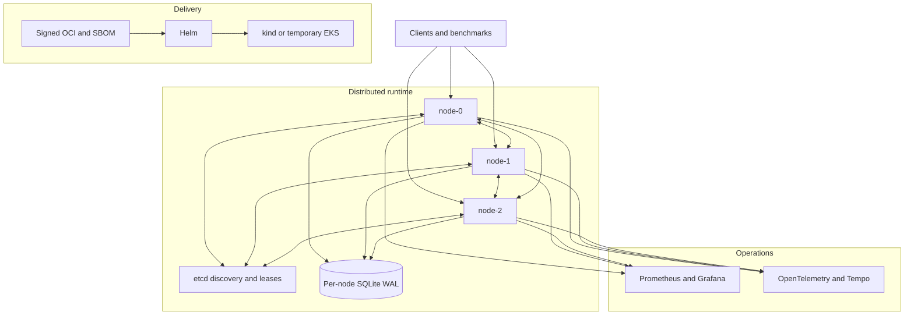

<div align="center">

# Advanced Distributed System

### Correctness-first distributed infrastructure for reliable AI/ML services

**Causal CRDTs · Durable State · etcd · mTLS · Observability · Chaos Engineering · Kubernetes · Terraform · AWS**

[](https://github.com/Parmodk2310/Advanced-Distributed-System/actions/workflows/ci.yml)
[](https://github.com/Parmodk2310/Advanced-Distributed-System/actions/workflows/phase7-local-kubernetes.yml)
[](https://github.com/Parmodk2310/Advanced-Distributed-System/actions/workflows/phase7-image-publish.yml)


[Architecture](#architecture) · [Verified results](#verified-results) · [Quick start](#quick-start) · [Documentation](docs/README.md) · [Engineering decisions](#engineering-decisions) · [Release](#release)

**Phase 7 verified complete · [v0.7.0 released](https://github.com/Parmodk2310/Advanced-Distributed-System/releases/tag/v0.7.0)**

</div>

---

## Why this project exists

Production AI/ML systems need infrastructure that does more than serve a model.
They must bound expensive work, route requests across nodes, preserve causal
context, converge replicated state, recover after restart, authenticate peers,
expose useful telemetry, survive controlled faults, and ship reproducibly.

This project implements and tests those concerns as a seven-phase distributed
runtime. It is a systems-engineering portfolio project, not a claim of a
commercially hosted service.

## What it demonstrates

| Capability | Implementation |
| --- | --- |
| Bounded execution | asyncio, process workers, backpressure, rate limits, deadlines |
| Cluster coordination | SWIM-style membership, incarnation-aware rejoin, etcd leases |
| Deterministic routing | SHA-256 consistent hashing and failover candidates |
| Replicated state | causal sessions, version vectors, CRDTs, anti-entropy repair |
| Durable recovery | per-node SQLite WAL, persist-before-ack, restart restore |
| Peer security | TLS 1.3, mTLS, certificate SAN identity validation |
| Operations | Prometheus, OpenTelemetry, Tempo, Grafana, controlled chaos |
| Delivery | OCI, SBOM, signing, Helm, kind, Terraform, temporary AWS EKS |

## Verified results

| Gate | Result |
| --- | --- |
| Automated test suite | **439 passed, 8 skipped** |
| Ruff, Black, mypy, compile checks | **PASS** |
| Gitleaks and Trivy | **PASS** |
| SPDX SBOM and keyless signing | **PASS** |
| Three-replica local Kubernetes deployment | **PASS** |
| CRDT convergence and mTLS rejection | **PASS** |
| PVC restart persistence and Helm rollback | **PASS** |
| Reviewed Terraform plan | **23 add · 0 change · 0 destroy** |
| Temporary AWS EKS apply, verify, and destroy | **PASS** |
| Residual AWS resource check | **PASS** |
| Current AWS execution gate | **Disabled** |

The AWS demonstration used one `t3.medium` worker and was destroyed after
verification. It proves a controlled delivery lifecycle, not multi-AZ or
node-level high availability. See the [Phase 7 evidence ledger](docs/verification/phase7.md).

## Architecture



Each node owns its local SQLite WAL store; the diagram groups those stores for
readability. Detailed diagrams and source mappings are in the
[architecture index](docs/architecture/README.md).

## Engineering decisions

- **Bound expensive work.** CPU-heavy tasks execute behind bounded workers so
  the event loop cannot become an unlimited queue.
- **Make overload explicit.** Backpressure, rate limits, deadlines, retries,
  and circuit breakers are observable behavior.
- **Separate liveness from ownership.** Membership tracks node state;
  consistent hashing assigns deterministic owners and failover candidates.
- **Use targeted consistency.** Version vectors, causal tokens, and CRDTs
  provide causal convergence without claiming total order or linearizability.
- **Persist before acknowledgement.** Supported durable mutations commit to
  local SQLite before ACK; this is local durability, not quorum durability.
- **Bind encryption to identity.** mTLS transport is paired with logical node
  identity checks against certificate SANs.
- **Keep telemetry off the correctness path.** Telemetry failure does not
  become a data-path correctness failure.
- **Make cloud demonstrations reversible.** Apply requires review and explicit
  approval; verification is followed by teardown and residual checks.

## Failure scenarios exercised

| Scenario | Observed behavior |
| --- | --- |
| Peer delay or partition | bounded degradation; cleanup restores connectivity |
| etcd outage | coordination degrades without unnecessarily stopping data-plane work |
| Node termination | surviving nodes continue within tested bounds; node rejoins |
| Pod restart | durable state is restored from the same PVC |
| Untrusted peer | mTLS connection is rejected |
| Invalid Helm upgrade | rollout fails; rollback restores the healthy release |
| AWS teardown | application, storage, cluster, registry, and network are removed |

These are bounded tested scenarios, not proofs of arbitrary fault tolerance.

## Quick start

Requirements: Python 3.12 and Docker. The full delivery gate also requires
kind, kubectl, Helm, Terraform, Conftest, and kubeconform.

```bash
git clone https://github.com/Parmodk2310/Advanced-Distributed-System.git
cd Advanced-Distributed-System

python3.12 -m venv .venv
source .venv/bin/activate
python -m pip install --upgrade pip
python -m pip install -r requirements-dev.txt
python -m pip install -e .

make quality
```

Run the complete local Kubernetes release gate:

```bash
make phase7-release-gate
```

The gate builds and scans the image, validates Kubernetes and Terraform,
creates a temporary kind cluster, verifies distributed behavior, persistence,
and rollback, then cleans up. **It does not create AWS resources.**

## Phase progression

| Phase | Focus | Status |
| --- | --- | --- |
| 1 | Async protocol foundation | Complete |
| 2 | Compute isolation and resilience | Complete |
| 3 | Membership and routing | Complete |
| 4 | Causal sessions and CRDT replication | Complete |
| 5 | Durable state, recovery, etcd, mTLS | Complete |
| 6 | Observability, chaos, performance | Complete |
| 7 | Kubernetes, supply chain, AWS, rollback, teardown | **Verified complete** |

See the [Phase 1–7 evolution](docs/architecture/phase1-7-evolution.md) for the
architecture progression and evidence links.

## Repository map

```text
.
├── src/distsys/                 # distributed runtime
├── tests/                       # unit, integration, and deployment contracts
├── proto/                       # protocol definitions
├── deploy/                      # Helm, kind, and temporary AWS/EKS IaC
├── scripts/                     # Phase 6–7 verification and teardown
└── docs/
    ├── architecture/            # system evolution and rendered diagrams
    ├── design/                  # detailed correctness contracts
    ├── runbooks/                # operator procedures
    ├── verification/            # evidence ledgers
    └── releases/                # formal release notes
```

## Technology

Python 3.12 · asyncio · Protobuf · SQLite WAL · etcd · CRDTs · TLS 1.3/mTLS ·
Prometheus · OpenTelemetry · Tempo · Grafana · Toxiproxy · Docker · Helm ·
kind · Kubernetes · OPA/Conftest · kubeconform · Terraform · AWS EKS/ECR/EBS ·
GitHub Actions

## Scope boundaries

This project does **not** claim linearizability, consensus, quorum-durable
acknowledgements, exactly-once distributed execution, distributed ACID
transactions, Byzantine fault tolerance, multi-AZ availability, permanent
hosting, production SLOs, internet-scale capacity, or multi-region disaster
recovery.

Stating these boundaries is part of the correctness story.

## Release

[`v0.7.0 — Verified Kubernetes and AWS Delivery Lifecycle`](https://github.com/Parmodk2310/Advanced-Distributed-System/releases/tag/v0.7.0)
is the first formal GitHub Release. Its source commit, signed image digest, SBOM
checksum, workflow runs, and limitations are recorded in the
[release notes](docs/releases/v0.7.0.md) and [changelog](CHANGELOG.md).
Those records deliberately separate the **Phase 7 AWS demonstration identity**
from the **v0.7.0 release identity**.

Historical tags are development milestones. No synthetic `v0.5.0` tag was
created to fill the historical sequence.

## Security, contributing, and license

- [Security policy](SECURITY.md)
- [Contribution guide](CONTRIBUTING.md)
- [Apache License 2.0](LICENSE)

Third-party projects and cloud services remain under their own licenses and terms.
