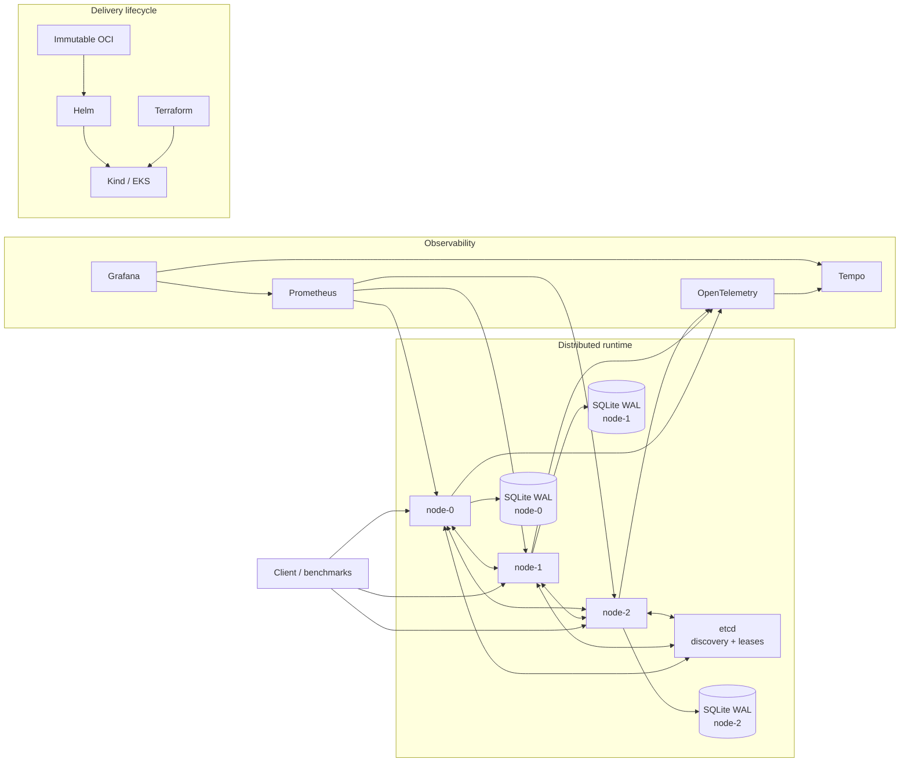

# Advanced Distributed System

[](https://github.com/Parmodk2310/Advanced-Distributed-System/actions/workflows/ci.yml)
[](https://github.com/Parmodk2310/Advanced-Distributed-System/actions/workflows/phase7-local-kubernetes.yml)
[](https://github.com/Parmodk2310/Advanced-Distributed-System/actions/workflows/phase7-image-publish.yml)
[](LICENSE)

**Correctness-first distributed infrastructure for reliable AI/ML services.**

A seven-phase engineering project that evolves from a bounded async execution
engine into a secure, durable, observable, fault-tested distributed platform
with reproducible Kubernetes and temporary AWS EKS delivery.

> **Verified checkpoint:** `cd89ed476c7898cae9d0cb19158075ccfbd46d86`
> **Cloud posture:** the AWS environment was temporary and was destroyed after
> verification. No permanently hosted production service is claimed.

---

## The problem

Production AI/ML systems need more than inference. They also need infrastructure
that can:

- isolate CPU-heavy work from the async event loop,
- bound overload instead of collapsing unpredictably,
- route work across nodes,
- preserve causal context,
- converge replicated state,
- recover durable state after restart,
- authenticate peer nodes,
- expose useful telemetry,
- survive controlled failures,
- ship reproducibly,
- and prove that cloud infrastructure is actually removed afterward.

This repository builds and verifies those concerns directly.

---

## What was built

- bounded async + CPU execution
- backpressure, rate limiting, deadlines, retries, circuit breakers
- SWIM-style membership and incarnation-aware rejoin
- SHA-256 consistent hashing and failover routing
- causal sessions and CRDT replication
- GCounter, PNCounter, ORSet, MVRegister
- SQLite WAL durability and restart recovery
- etcd discovery and TTL leases
- TLS 1.3 and mutual TLS
- Prometheus, OpenTelemetry, Tempo, Grafana
- deterministic chaos testing
- reproducible performance checks
- hardened non-root OCI packaging
- SBOM + secret/vulnerability scanning
- Helm + kind + Kubernetes policy validation
- Terraform-managed temporary AWS EKS delivery
- rollback, persistence, external smoke, teardown, residual-resource checks

---

## Verified outcome

| Area | Result |
| --- | --- |
| Automated test suite | **435 passed, 8 skipped** |
| Python quality | Ruff, Black, mypy, compile checks **PASS** |
| Secret / vulnerability gates | **PASS** |
| Supply chain | SPDX SBOM + keyless-signed immutable digest |
| Local Kubernetes | three application replicas **PASS** |
| CRDT convergence | **PASS** |
| mTLS rejection | **PASS** |
| PVC persistence / reuse | **PASS** |
| Failed-upgrade rollback | **PASS** |
| Reviewed Terraform plan | **23 add · 0 change · 0 destroy** |
| Temporary AWS EKS apply | **PASS** |
| External endpoint cleanup | **PASS** |
| AWS destroy | **PASS** |
| Residual-resource verification | **PASS** |
| Final AWS execution gate | **Disabled** |

The AWS demonstration intentionally used **one `t3.medium` worker**. It proved a
controlled delivery lifecycle, not multi-AZ or node-level high availability.

Full evidence:
[`docs/verification/phase7.md`](docs/verification/phase7.md)

---

## Architecture



Architecture references:

- [Phase 1–7 evolution](docs/architecture/phase1-7-evolution.md)
- [Architecture index](docs/architecture/README.md)
- [Phase 6 observability / chaos / performance](docs/architecture/phase6-observability-chaos-performance.md)
- [Phase 7 production delivery](docs/architecture/phase7-production-delivery.md)

---

## Engineering decisions

### Bound the expensive work

CPU-heavy tasks run behind bounded workers so the event loop is not used as an
uncontrolled work queue.

### Make overload explicit

Backpressure, rate limits, deadlines, retries, and circuit breakers are
first-class behavior rather than hidden side effects.

### Separate liveness from ownership

SWIM-style membership tracks node state; consistent hashing decides deterministic
ownership and failover candidates.

### Use causal semantics without pretending to provide total order

Version vectors, dotted mutation identity, causal tokens, and session guarantees
provide targeted consistency without claiming linearizability.

### Persist before acknowledging supported durable mutations

SQLite commits durable CRDT state before ACK. That is **local durability**, not
quorum durability.

### Bind encryption to peer identity

TLS 1.3/mTLS is combined with logical node identity checks against certificate
SANs.

### Keep telemetry off the correctness-critical path

Observability is important, but telemetry failure should not become a data-path
correctness failure.

### Make cloud demos reversible

The AWS path requires a reviewed plan, explicit approval, exact artifact
promotion, verification, and teardown evidence.

---

## Failure scenarios exercised

| Scenario | Verified behavior |
| --- | --- |
| Peer delay | degraded latency; cleanup restores baseline |
| Peer partition | selected path fails; cleanup restores connectivity |
| etcd outage | coordination degrades without unnecessarily stopping data plane |
| Node kill | remaining nodes continue within tested bounds; node rejoins |
| Pod restart | durable state restored from same PVC |
| Bad mTLS peer | connection rejected |
| Unhealthy Helm upgrade | rollout fails; rollback restores healthy release |
| AWS teardown | application, volumes, cluster, registry, network removed |

These are bounded tested scenarios, not proofs of arbitrary fault tolerance.

---

## Quick start

### Requirements

- Python 3.12
- Docker
- kind
- kubectl
- Helm
- Terraform

### Setup

```bash
git clone https://github.com/Parmodk2310/Advanced-Distributed-System.git
cd Advanced-Distributed-System

python3.12 -m venv .venv
source .venv/bin/activate

python -m pip install --upgrade pip
python -m pip install -r requirements-dev.txt
python -m pip install -e .
```

### Fast quality gate

```bash
make quality
```

### Full local Phase 7A release gate

```bash
make phase7-release-gate
```

The local gate builds/scans the image, validates Kubernetes/Terraform,
starts a temporary kind cluster, verifies distributed behavior, persistence and
rollback, then cleans up.

**It does not create AWS resources.**

---

## Phase 7 AWS demonstration identity

The following immutable identifiers belong to the successful temporary AWS
demonstration. They are historical verification evidence; they are **not** the
source or image identity of the forthcoming formal `v0.7.0` release.


```text
Source commit
cd89ed476c7898cae9d0cb19158075ccfbd46d86

GHCR image
sha256:6db4ce3304128c8e7aa119d0bc11a8092f1697687a47b68cef42f2b01231e68d

SPDX SBOM artifact
sha256:749f030421e7aae273412822e304ebfdc1982921cc871b96e20103d7db7993c9
```

### v0.7.0 release identity

The formal release will record its exact tagged source commit, GHCR manifest
digest, SPDX SBOM, keyless signature, and provenance after the release
candidate passes the image and local Kubernetes workflows. Until those checks
finish, no newer digest is claimed here.

Detailed evidence:

- [`docs/verification/phase7.md`](docs/verification/phase7.md)
- [`docs/verification/phase6.md`](docs/verification/phase6.md)
- [AWS runbook](docs/runbooks/phase7-aws-demonstration.md)
- [Rollback runbook](docs/runbooks/phase7-rollback.md)
- [Security / secrets runbook](docs/runbooks/phase7-security-and-secrets.md)

---

## Phase progression

| Phase | Focus | Status |
| --- | --- | --- |
| 1 | Async protocol foundation | Complete |
| 2 | Compute isolation and resilience | Complete |
| 3 | Membership and routing | Complete |
| 4 | Causal sessions and CRDT replication | Complete |
| 5 | Durable state, recovery, etcd, mTLS | Complete |
| 6 | Observability, chaos, performance | Complete |
| 7 | Kubernetes, supply chain, AWS, rollback, teardown | **Verified complete** |

Historical details remain in `docs/`.

---

## Repository map

```text
.
├── src/distsys/                 # distributed runtime
├── tests/                       # unit, integration, deployment contracts
├── proto/                       # protocol definitions
├── deploy/
│   ├── helm/                    # app + etcd charts
│   ├── kind/                    # local Kubernetes
│   └── terraform/aws/           # temporary AWS/EKS infrastructure
├── scripts/
│   ├── phase6/                  # observability/chaos/performance
│   └── phase7/                  # delivery/verification/teardown
├── docs/
│   ├── architecture/
│   ├── design/
│   ├── runbooks/
│   └── verification/
├── Dockerfile
├── Makefile
└── pyproject.toml
```

---

## Technology

Python 3.12 · asyncio · Protobuf · SQLite WAL · etcd · CRDTs · TLS 1.3/mTLS ·
Prometheus · OpenTelemetry · Tempo · Grafana · Toxiproxy · Docker · Helm ·
kind · Kubernetes · OPA/Conftest · kubeconform · Terraform · AWS EKS/ECR/EBS ·
GitHub Actions

---

## What this project does **not** claim

- linearizability
- Raft/Paxos or another consensus protocol
- quorum-durable acknowledgements
- exactly-once distributed execution
- distributed ACID transactions
- globally serializable writes
- arbitrary Byzantine fault tolerance
- multi-AZ or node-level HA from the one-worker AWS demo
- a permanently hosted production service
- production SLOs
- internet-scale capacity
- multi-region disaster recovery
- universal benchmark numbers

These boundaries are part of the engineering story.

---

## Releases

`v0.7.0` is intended to be the first formal GitHub Release after the
public-readiness review.

- [`CHANGELOG.md`](CHANGELOG.md)
- [`docs/releases/v0.7.0.md`](docs/releases/v0.7.0.md)

Historical tags remain development milestones. A missing historical `v0.5.0`
tag should not be fabricated.

---

## Security, contributing, and license

- Security policy: [`SECURITY.md`](SECURITY.md)
- Contribution guide: [`CONTRIBUTING.md`](CONTRIBUTING.md)
- License: [Apache License 2.0](LICENSE)

Third-party projects and cloud services remain under their own licenses and
terms.
