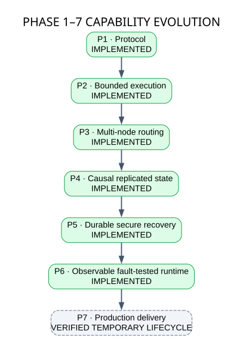
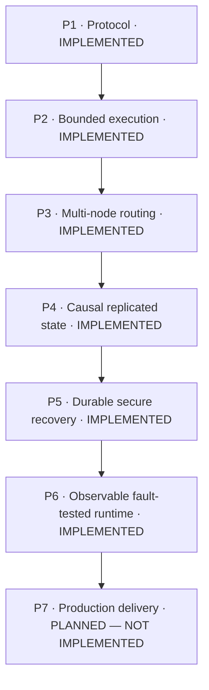

# Phase 1–7 Capability Evolution

**Status: Phases 1–6 implemented and verified; Phase 7 planned and not implemented.**

The system grows by preserving earlier guarantees while adding a new engineering boundary in each phase.

## GitHub-native diagram

| Phase | Capability added | Evidence |
| --- | --- | --- |
| 1 | Typed framed asynchronous runtime | Source and single-node tests |
| 2 | Bounded execution and overload control | [Verification](../verification/phase2.md) |
| 3 | Membership, failure detection and routing | [Verification](../verification/phase3.md) |
| 4 | Causal CRDT replication and convergence | [Verification](../verification/phase4.md) |
| 5 | Durable recovery, etcd coordination and mTLS | [Verification](../verification/phase5.md) |
| 6 | Telemetry, controlled faults and performance gates | [Verification](../verification/phase6.md) |
| 7 | Local Kubernetes to AWS EKS delivery | Planned only |

See the [architecture guide](README.md), [design specifications](../design/) and [roadmap](../roadmap.md).
