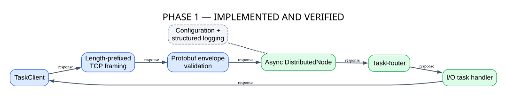
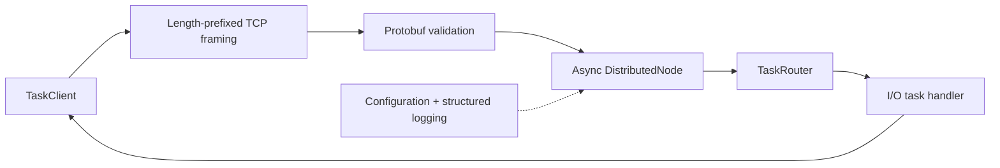

# Phase 1 — Foundation and Single Node

**Status: IMPLEMENTED AND VERIFIED**

Phase 1 establishes a typed, framed asynchronous request/response runtime without distributed behavior.

## GitHub-native diagram

## Source mapping

- `src/distsys/client.py`: client request/response API.
- `src/distsys/protocol/`: framing, envelopes, codecs and protocol errors.
- `src/distsys/node.py`: asynchronous listener and lifecycle.
- `src/distsys/compute/router.py`: task dispatch.
- `src/distsys/compute/tasks.py`: task implementations.

The phase provides bounded message validation and asynchronous execution. It does not provide clustering, replication, durable state or distributed failure handling.
