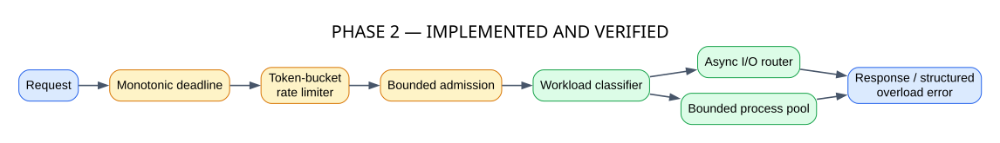
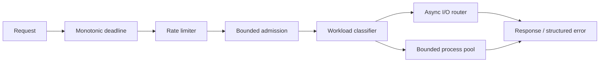

# Phase 2 — Compute and Resilience

**Status: IMPLEMENTED AND VERIFIED**

Phase 2 protects the event loop and bounds overload before dispatching I/O or CPU-heavy work.

## GitHub-native diagram

## Source mapping

- `src/distsys/compute/`: classification, task execution and bounded process workers.
- `src/distsys/resilience/`: backpressure, rate limiting, deadlines, retry and circuit breaking.
- `src/distsys/node.py`: ordered request-pipeline integration.

One monotonic deadline is preserved through admission and execution. Retry and circuit breaking remain scoped primitives. Phase 2 is still a single-node runtime.
