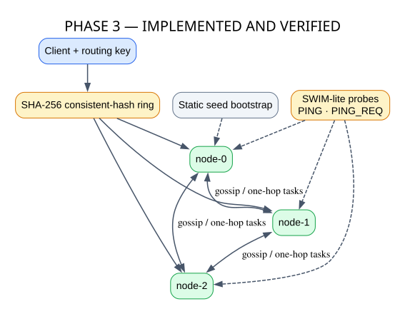
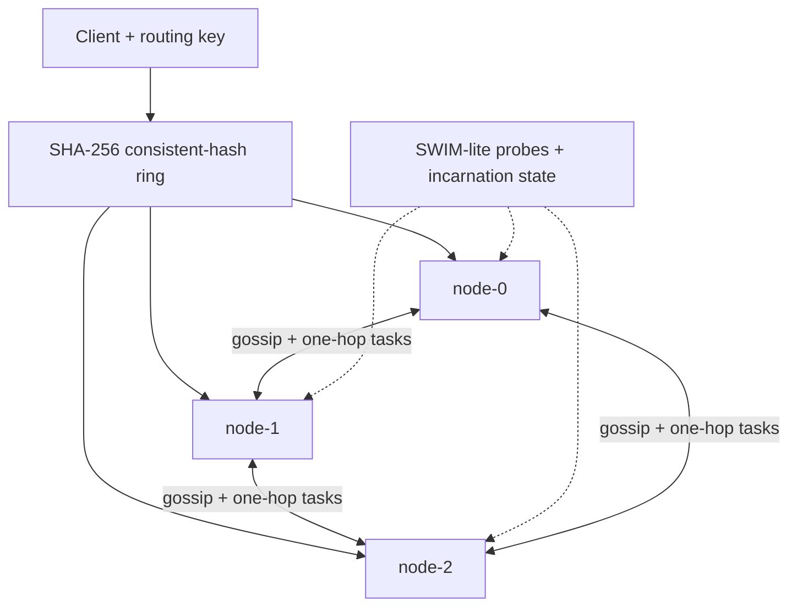

# Phase 3 — Distributed Cluster

**Status: IMPLEMENTED AND VERIFIED**

Phase 3 evolves the runtime into a decentralized three-node cluster with deterministic ownership and failure-aware routing.

## GitHub-native diagram

## Source mapping

- `src/distsys/cluster/`: membership, gossip, failure detection, peer transport, consistent hashing and routing.
- `src/distsys/node.py`: cluster lifecycle and routed request integration.

Static seeds bootstrap membership; gossip decentralizes it. Direct and indirect probes drive `ALIVE → SUSPECT → DEAD`, while incarnations support safe rejoin. Routing is best-effort/idempotent, not exactly once.
