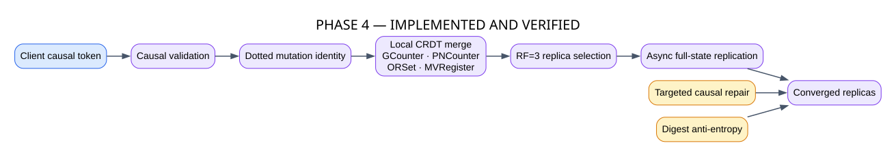
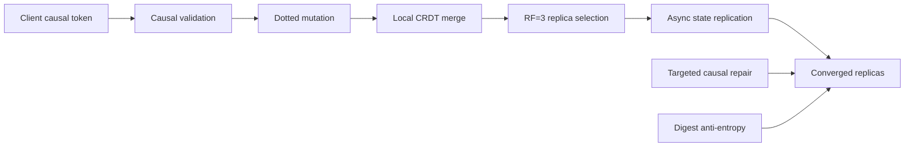

# Phase 4 — Causal Consistency and CRDT Replication

**Status: IMPLEMENTED AND VERIFIED**

Phase 4 adds primary-less replicated state with client-session causal guarantees and deterministic convergence.

## GitHub-native diagram

## Source mapping

- `src/distsys/causal/`: actors, dots, version vectors, tokens and clocks.
- `src/distsys/crdt/`: GCounter, PNCounter, ORSet and MVRegister.
- `src/distsys/storage/`: in-memory CRDT state.
- `src/distsys/replication/`: placement, outbox, replication, repair and anti-entropy.
- `src/distsys/crdt_service.py` and `src/distsys/crdt_client.py`: service and client boundaries.

The system provides read-your-writes, monotonic reads/writes and writes-follow-reads for supported sessions. It does not claim consensus, linearizability, quorum durability or distributed transactions.
