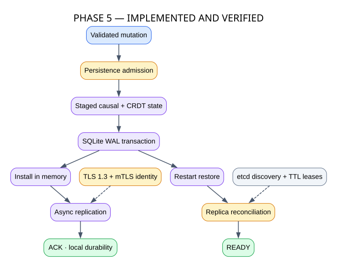
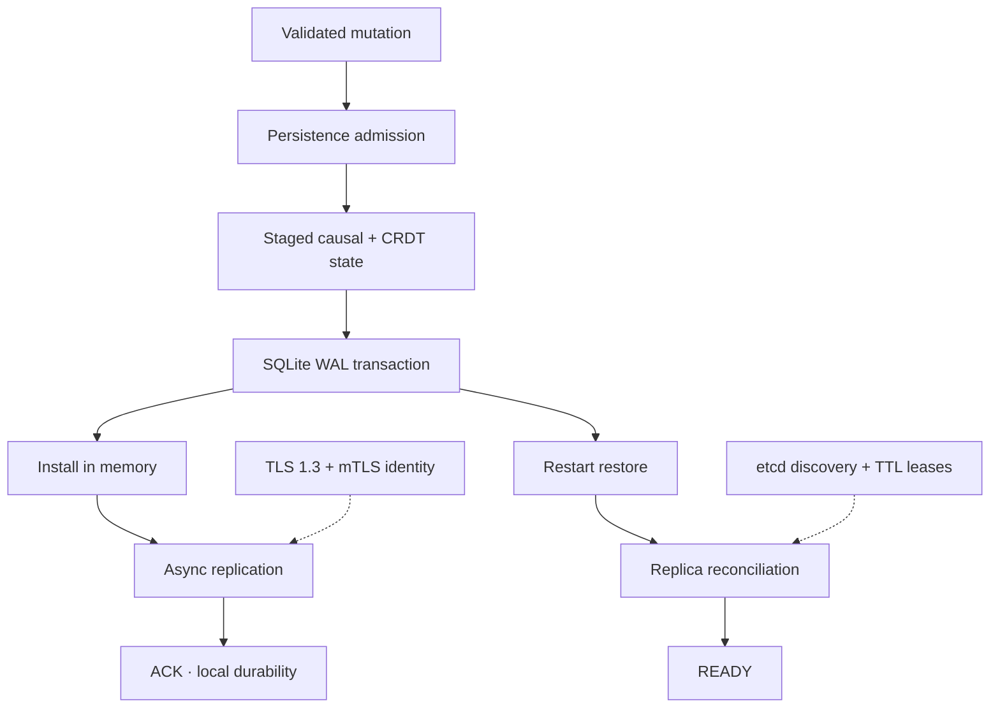

# Phase 5 — Secure Persistence and Recovery

**Status: IMPLEMENTED AND VERIFIED**

Phase 5 makes local acknowledgements durable, restores node state after restart and secures peer identity.

## GitHub-native diagram

## Source mapping

- `src/distsys/persistence/`: SQLite/WAL repository, migrations, durable adapter and backup.
- `src/distsys/recovery/`: restore and reconciliation orchestration.
- `src/distsys/coordination/`: etcd registration, leases and discovery.
- `src/distsys/security/`: TLS contexts, certificate identity and trust checks.
- `src/distsys/health/`: readiness state.

An ACK means the local SQLite transaction committed before memory installation. This is local durability—not quorum durability. etcd holds coordination state, not authoritative CRDT application state.
