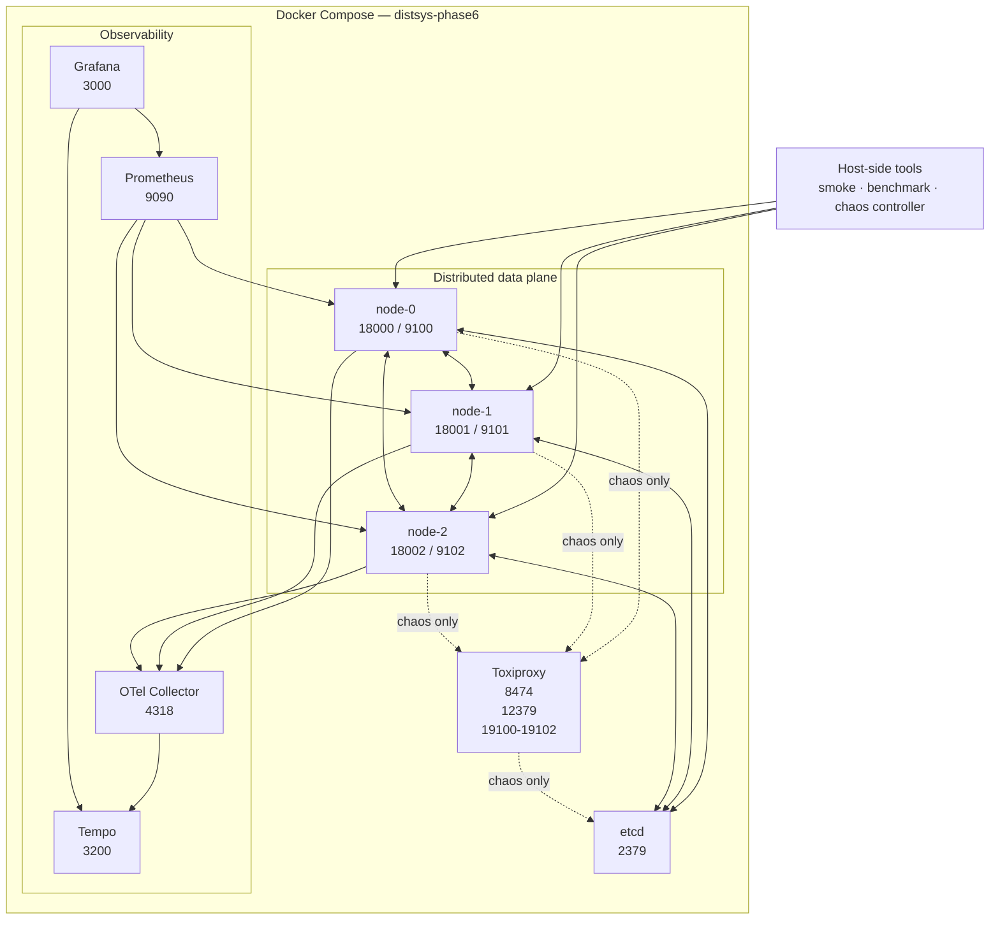

# Phase 6 — Observability, Chaos and Performance

**Status: IMPLEMENTED AND VERIFIED**

## Purpose

Phase 6 adds production-style observability, controlled fault injection, and reproducible performance verification to the secure/durable distributed cluster completed in Phase 5.

The principal design rule is:

> Observability and chaos tooling may observe or perturb the system, but they must not silently become part of the healthy correctness path.

That principle drives the separation between the **direct** and **proxy** runtime profiles.

---

## Logical architecture



---

## Runtime services

| Service | Internal role | Host-published endpoint |
| --- | --- | --- |
| `node-0` | application + CRDT/peer runtime | `18000`, observability `9100` |
| `node-1` | application + CRDT/peer runtime | `18001`, observability `9101` |
| `node-2` | application + CRDT/peer runtime | `18002`, observability `9102` |
| `etcd` | discovery + TTL leases | proxied for chaos through `12379` |
| `toxiproxy` | managed fault injection | API `8474` |
| `prometheus` | metrics scraping | `9090` |
| `grafana` | dashboards | `3000` |
| `tempo` | distributed trace storage/query | `3200` |
| `otel-collector` | OTLP collection/forwarding | `4318` |

---

## Direct profile

```text
PHASE6_PEER_ROUTING=direct
```

Direct mode is used for healthy baseline verification and performance tests.

```text
node-0 ───────────────► node-1
node-1 ───────────────► node-2
node-2 ───────────────► node-0

          direct Docker DNS
```

Used for:

- observability smoke,
- monitoring smoke,
- task benchmark,
- CRDT benchmark.

---

## Proxy profile

```text
PHASE6_PEER_ROUTING=proxy
RUN_CHAOS_TESTS=1
```

Peer mapping:

```text
node-0 -> toxiproxy:19100 -> node-0:18000
node-1 -> toxiproxy:19101 -> node-1:18001
node-2 -> toxiproxy:19102 -> node-2:18002
```

etcd proxy:

```text
toxiproxy:12379 -> etcd:2379
```

Only explicitly mapped peer IDs are rewritten.

---

## Why direct and proxy profiles are separate

If Toxiproxy were always in the healthy path:

- baseline latency would include proxy overhead,
- benchmark evidence would describe the fault-injection topology,
- proxy faults could be confused with runtime defects.

If Toxiproxy were used only for bootstrap:

- steady-state peer communication could bypass the injected fault.

The explicit routing profiles avoid both problems.

---

## Staged startup

```text
build node container image
      ↓
start etcd / Toxiproxy / Tempo / OTel
      ↓
wait for Toxiproxy API
      ↓
create managed proxies
      ↓
start node-0 / node-1 / node-2
      ↓
wait for node health
      ↓
start Prometheus / Grafana
      ↓
write managed manifest
```

The release gate considers the cluster ready only when:

```text
node-0 ready
AND node-1 ready
AND node-2 ready
AND manifest.json exists
```

---

## Managed manifest

Conceptually:

```json
{
  "pids": {},
  "proxies": [
    "peer-node-0",
    "peer-node-1",
    "peer-node-2",
    "etcd"
  ],
  "services": [
    "etcd",
    "node-0",
    "node-1",
    "node-2"
  ]
}
```

Chaos actions are constrained to managed resources.

---

## Observability data flow

### Metrics

```text
node-0:9100 ─┐
node-1:9101 ─┼──► Prometheus ───► Grafana
node-2:9102 ─┘
```

Prometheus uses Compose service DNS:

```text
node-0:9100
node-1:9101
node-2:9102
```

### Tracing

```text
distributed operation
        │
        ▼
OpenTelemetry instrumentation
        │
        ▼
OTel Collector :4318
        │
        ▼
Tempo
        │
        ▼
Grafana
```

---

## Cardinality policy

Prometheus labels remain bounded. High-cardinality or sensitive values do not become metric labels, including:

- CRDT keys,
- CRDT values,
- causal tokens,
- correlation IDs,
- arbitrary exception strings,
- filesystem paths,
- certificates,
- secrets.

---

## Health model

Phase 6 exposes:

```text
/health/live
/health/ready
/metrics
```

Readiness incorporates the existing recovery/cluster health model.

---

## Benchmark flow

```text
BenchmarkRunner
      │
      ├── fixed profile
      ├── fixed seed
      ├── warm-up
      ├── measured window
      │
      ▼
direct Phase 6 cluster
      │
      ▼
response validation
      │
      ├── success/failure
      ├── correctness
      ├── latency
      └── throughput
      │
      ▼
JSON artifact + environment metadata
```

---

## Chaos flow

```text
scripts/chaos.py
      │
      ▼
ChaosController
      │
      ├── SafetyPolicy / manifest
      ├── Toxiproxy client
      └── Docker Compose lifecycle
             │
             ▼
       controlled fault
             │
             ▼
        observe degraded state
             │
             ▼
           cleanup
             │
             ▼
        verify recovery
```

Every final Phase 6 scenario records:

```text
passed=true
cleanup_ok=true
```

---

## Network-delay experiment

Expected invariant:

```text
peer latency degrades measurably
AND appropriate local work remains possible
AND latency returns near baseline after cleanup
```

---

## Partition experiment

```text
peer path enabled
      ↓
disable selected proxy path
      ↓
target peer unreachable
      ↓
local data plane remains healthy
      ↓
enable path
      ↓
target reachable again
```

---

## etcd-outage experiment

```text
healthy coordination
      ↓
docker compose stop etcd
      ↓
coordination degrades
      ↓
existing data plane remains usable
      ↓
docker compose start etcd
      ↓
leases / coordination recover
```

---

## Node-kill experiment

```text
node-0  healthy
node-1  healthy   ◄── target
node-2  healthy

        │
        ▼

docker compose kill node-1

        │
        ▼

node-0  ready
node-1  unavailable
node-2  ready

        │
        ▼

docker compose start node-1

        │
        ▼

node-0  ready
node-1  recovered
node-2  ready
```

---

## Persistent state

The persistence model remains:

```text
application mutation
      ↓
SQLite transaction
      ↓
local durable commit
      ↓
memory installation
      ↓
async replication
      ↓
ACK
```

Container lifecycle does not imply ephemeral CRDT semantics.

---

## Failure boundaries

```text
Node process/container
    runtime / health / SWIM failure domain

Peer network path
    Toxiproxy fault domain

etcd
    coordination/discovery failure domain

Prometheus/Grafana/Tempo
    observability failure domain

SQLite
    local durable-state failure domain
```

---

## Laptop-safe operation

Final Phase 6 verification environment exposed approximately:

```text
16 logical CPUs
8.15 GB WSL memory
```

The quick profile is intentionally short and bounded.

---

## Phase 1–5 compatibility

Phase 6 builds on:

```text
Phase 1  protocol + bounded async node
Phase 2  compute isolation + resilience
Phase 3  membership + routing
Phase 4  causal consistency + CRDT replication
Phase 5  durability + recovery + etcd + mTLS
```

Full repository suite at closure:

```text
373 passed, 8 skipped
```

---

## Security boundary

Preserved:

- TLS 1.3 secure profile,
- mutual certificate authentication,
- logical node certificate identity,
- no secrets in Prometheus labels,
- loopback host publication for local endpoints.

---

## Release gate architecture

```text
make quality
     │
     ▼
start direct cluster
     │
     ├── observability smoke
     ├── monitoring / trace smoke
     ├── task benchmark
     └── CRDT benchmark
     │
     ▼
stop direct cluster
     │
     ▼
start proxy cluster
     │
     ├── wait nodes
     └── wait manifest
     │
     ▼
network-delay
     │
     ▼
partition
     │
     ▼
etcd-outage
     │
     ▼
node-kill
     │
     ▼
cleanup
     │
     ▼
Phase 6 release gate passed
```

---

## Phase 6 completion boundary

Phase 6 is complete when:

```text
repository quality        green
three-node runtime        healthy
metrics                   scrapeable
traces                    queryable
dashboards                provisioned
task benchmark            valid
CRDT benchmark            valid
network-delay chaos       passed + cleaned
partition chaos           passed + cleaned
etcd outage               passed + recovered
node kill                 passed + recovered
runtime cleanup           successful
```

Satisfied at implementation checkpoint:

```text
296fdd8
```

---

## Phase 7 handoff

Phase 7 may add:

- CI/CD hardening,
- production container packaging,
- Kubernetes,
- Helm,
- cloud infrastructure,
- deployment runbooks,
- release process,
- portfolio/recruiter packaging.

Phase 7 must preserve the Phase 6 verification boundary rather than bypassing it.
