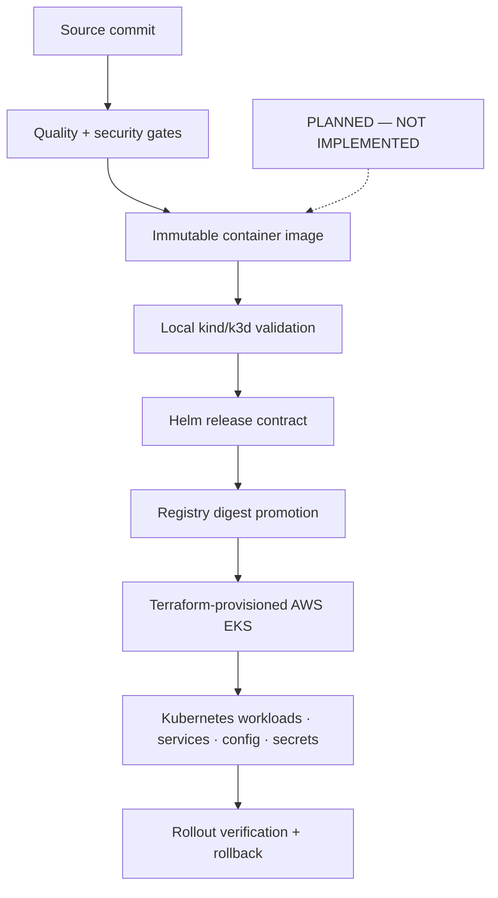

# Phase 7 — Production Delivery and Cloud Deployment

**Status: PLANNED — NOT IMPLEMENTED**

Phase 7 will promote one immutable artifact from local Kubernetes validation into Terraform-provisioned AWS EKS.

## GitHub-native diagram

## Planned boundaries

- CI will build and identify an immutable image by digest.
- kind or k3d will validate the same Helm contract used by EKS.
- Terraform will provision AWS infrastructure; Helm will own Kubernetes release configuration.
- Secrets will enter through an external secrets integration rather than Git.
- Rollout verification and rollback will be explicit release gates.

No Phase 7 deployment, production-readiness or cloud-availability claim is made. The target must preserve every Phase 1–6 correctness and release-gate boundary.
