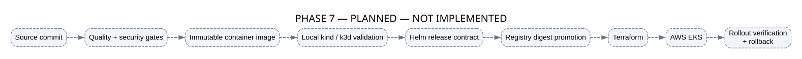
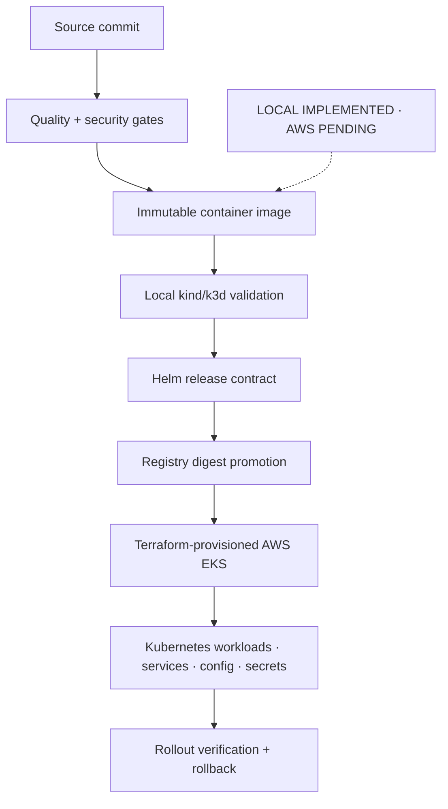

# Phase 7 — Production Delivery and Cloud Deployment

**Status: LOCAL KUBERNETES IMPLEMENTED — AWS EKS DEMONSTRATION PENDING**

Phase 7A packages the existing runtime as one hardened image and verifies a three-node Helm release on local Kubernetes. Phase 7B will promote the approved digest into Terraform-provisioned AWS EKS only after separate plan and cost approval.

## GitHub-native diagram

## Delivery boundaries

- CI builds and identifies an immutable image by digest.
- kind validates the same Helm contract intended for EKS; k3d is optional parity.
- Terraform will provision AWS infrastructure; Helm will own Kubernetes release configuration.
- Secrets will enter through an external secrets integration rather than Git.
- Rollout verification and rollback will be explicit release gates.

Local delivery does not claim production readiness or cloud availability. AWS resource creation remains disabled by default and requires separate approval. The target preserves every Phase 1–6 correctness and release-gate boundary.

See the [local runbook](../runbooks/phase7-local-kubernetes.md), [AWS demonstration runbook](../runbooks/phase7-aws-demonstration.md), and [verification record](../verification/phase7.md).
