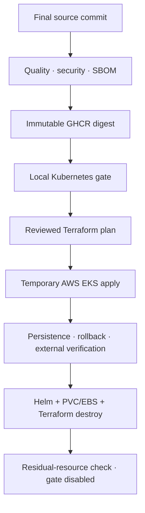

# Phase 7 — Production Delivery and Cloud Deployment

**Status: VERIFIED COMPLETE — LOCAL KUBERNETES AND TEMPORARY AWS EKS DEMONSTRATION**

Phase 7 packages the Phase 1–6 runtime as one hardened image, validates a
three-replica Helm release on local Kubernetes, and promotes the exact approved
image digest into a gated Terraform-provisioned AWS EKS demonstration. The AWS
environment was verified and then destroyed intentionally to prove lifecycle
convergence and prevent continuing cost.

## Verified delivery lifecycle

## Ownership boundaries

| Layer | Owner | Verified responsibility |
| --- | --- | --- |
| Source and image | GitHub Actions | Quality, security scan, SBOM and immutable digest |
| Kubernetes release | Helm | Application, etcd, configuration, services, PVCs and rollback |
| AWS infrastructure | Terraform | EKS, node group, ECR, VPC networking, EBS CSI and budget |
| Release authorization | Protected GitHub controls | Exact commit, digest, reviewed plan and explicit confirmation |
| Evidence and cleanup | Verification scripts/workflow | Persistence, rollback, public smoke, endpoint removal and teardown |

## Security and cost controls

- GitHub Actions authenticates to AWS with OIDC rather than stored access keys.
- The EKS API allowlist never permits `0.0.0.0/0`.
- A runner /32 is added temporarily and the approved CIDRs are restored on the
  unconditional cleanup path.
- The external load balancer exists only during the external verification step.
- AWS execution is disabled by default through `AWS_PHASE7_ENABLED=false`.
- The demonstration uses one worker, no NAT Gateway, a USD 15 budget boundary
  and expiration metadata.
- The approved GHCR artifact is copied into ECR without rebuilding.

## Completion evidence

The final commit was
`cd89ed476c7898cae9d0cb19158075ccfbd46d86`. Local Kubernetes, reviewed-plan,
apply/verification and destroy workflows all completed successfully. The full
run and artifact ledger is in [Phase 7 verification](../verification/phase7.md).

This is verified delivery engineering for a bounded demonstration, not a claim
that the system is a permanently hosted, multi-AZ production service. The
single-worker demonstration does not provide node- or AZ-level high
availability.

See the [local runbook](../runbooks/phase7-local-kubernetes.md), [AWS
demonstration runbook](../runbooks/phase7-aws-demonstration.md), [rollback
runbook](../runbooks/phase7-rollback.md), and [verification
record](../verification/phase7.md).
