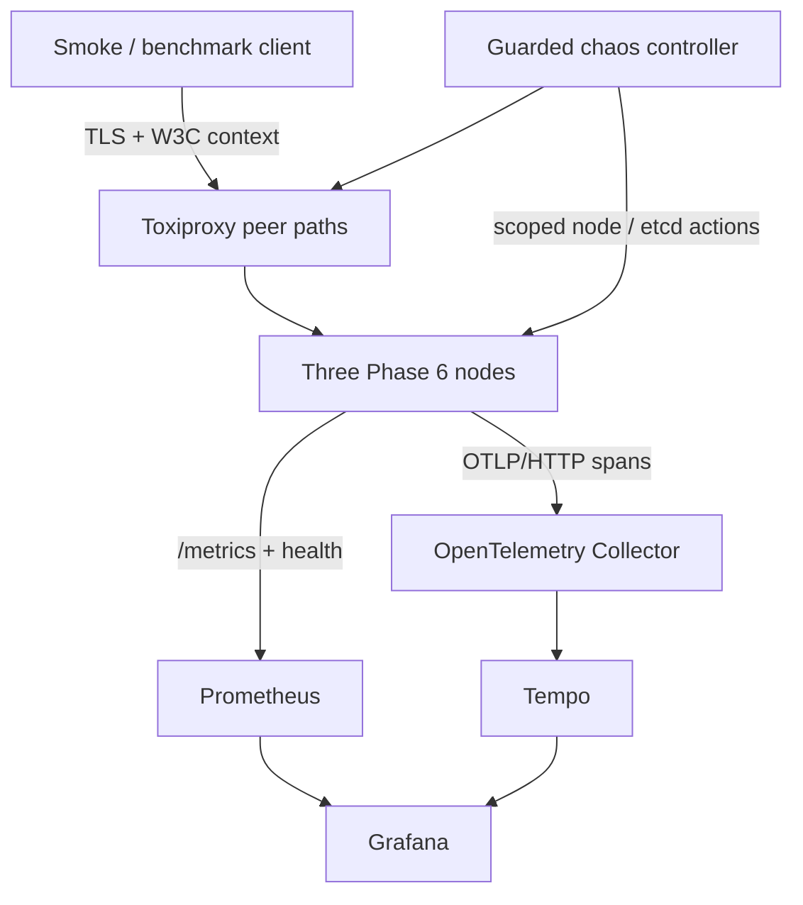

# Phase 6 Observability, Chaos, and Performance Implementation Plan

> **For agentic workers:** REQUIRED SUB-SKILL: Use superpowers:subagent-driven-development (recommended) or superpowers:executing-plans to implement this plan task-by-task. Steps use checkbox (`- [ ]`) syntax for tracking.

**Goal:** Add bounded-cardinality metrics, non-fatal distributed tracing, provisioned monitoring, safe fault injection, and reproducible correctness-aware benchmarks to the Phase 5 secure persistent cluster.

**Architecture:** Each `DistributedNode` owns an isolated Prometheus registry, an asyncio-only health/metrics listener, and a no-op-safe tracing runtime. Nodes export OTLP/HTTP spans through an OpenTelemetry Collector to Tempo; Prometheus scrapes ports 9100–9102 and Grafana provisions both data sources plus one committed dashboard. Dedicated runners own node PIDs, Toxiproxy mutations, benchmark artifacts, and idempotent cleanup.

**Tech Stack:** Python 3.12, asyncio, protobuf, prometheus-client, OpenTelemetry SDK/exporter, Docker Compose, Prometheus, Grafana, Tempo, OpenTelemetry Collector, Toxiproxy, pytest.

**Spec:** `docs/superpowers/specs/2026-09-13-phase6-observability-chaos-performance-design.md`

## Global Constraints

- Branch from Phase 5 `main` commit `3fb542e6804ac0e2cb75b46dbe2d05508ae8dff3` as `phase/6-observability-chaos`.
- Preserve Phase 1–5 protocol, mTLS, persistence, CRDT, recovery, and etcd behavior.
- Telemetry failures are non-fatal and never determine request success.
- Metrics use a dedicated `CollectorRegistry` per node process and only enumerated labels; unknown labels normalize to `other`.
- Metric labels never contain keys, correlation IDs, causal tokens, exception text, paths, certificates, or secrets.
- Traces may contain correlation IDs and peer IDs but never CRDT values, credentials, certificates, private keys, or causal-token contents.
- W3C fields are optional protobuf additions; messages from Phase 1–5 remain valid.
- Chaos requires `RUN_CHAOS_TESTS=1`, explicit managed targets, maximum durations, and idempotent cleanup.
- Performance tests require `RUN_PERFORMANCE_TESTS=1`; healthy quick profile requires success ratio >= 0.99, p95 < 0.500 seconds, and zero correctness failures.
- Default laptop profile: three nodes, one CPU worker per node, concurrency 16, 10-second warm-up, 30-second measurement, tracing sample ratio 0.10, no Loki.
- New integration tests use pytest-assigned explicit ports and existing WSL-safe wait helpers.
- Generated certificates, keys, databases, PID/manifest files, logs, toxics, and `benchmark-results/` are never committed.

## Architecture Figure

## File Map

| Responsibility | Files |
| --- | --- |
| Dependencies/config | `pyproject.toml`, `requirements.txt`, `requirements-dev.txt`, `.env.example`, `.gitignore`, `src/distsys/utils/config.py`, `tests/unit/test_config.py` |
| Metrics | `src/distsys/observability/__init__.py`, `src/distsys/observability/metrics.py`, `tests/unit/observability/test_metrics.py` |
| Health HTTP/lifecycle | `src/distsys/observability/health.py`, `src/distsys/node.py`, `tests/unit/observability/test_health.py`, `tests/integration/test_observability_endpoints.py` |
| Tracing/context | `src/distsys/observability/tracing.py`, `proto/messages.proto`, generated `messages_pb2.py/.pyi`, protocol/client/peer call sites, tracing unit/integration tests |
| Instrumentation | `src/distsys/node.py`, cluster/replication/CRDT/persistence/coordination/recovery modules, instrumentation integration tests |
| Monitoring | `deploy/monitoring/docker-compose.yml`, Prometheus/Collector/Tempo/Grafana provisioning, dashboard JSON, monitoring smoke test |
| Benchmarks | `src/distsys/benchmarking/{__init__,model,stats,runner}.py`, `scripts/benchmark.py`, benchmark unit/performance tests |
| Chaos | `src/distsys/chaos/{__init__,model,safety,toxiproxy,controller}.py`, `scripts/chaos.py`, chaos unit/scenario tests |
| Gates/docs | `scripts/run_phase6_cluster.sh`, `scripts/phase6_observability_smoke.py`, `scripts/phase6_verify.sh`, `Makefile`, Phase 6 manifest/verification docs, `README.md`, `docs/PHASES.md` |

---

### Task 1: Configuration and dependency foundation

**Files:**
- Modify: `pyproject.toml`
- Modify: `requirements.txt`
- Modify: `requirements-dev.txt`
- Modify: `.env.example`
- Modify: `.gitignore`
- Modify: `src/distsys/utils/config.py`
- Modify: `tests/unit/test_config.py`

**Interfaces:**
- Produces settings `observability_enabled: bool`, `observability_host: str`, `observability_port: int`, `metrics_enabled: bool`, `tracing_enabled: bool`, `otel_exporter_otlp_endpoint: str`, `otel_service_name: str`, `otel_trace_sample_ratio: float`, and `otel_export_timeout_seconds: float`.

- [ ] **Step 1: Write failing configuration tests** for defaults, environment parsing, ports outside `1..65535`, sample ratios outside `0.0..1.0`, and non-positive export timeout.
- [ ] **Step 2: Verify red** with `PYTHONPATH=src python -m pytest -q tests/unit/test_config.py`; expected failure is missing Phase 6 fields.
- [ ] **Step 3: Add minimal settings and validation**, using the existing `_env_bool` parser. Add runtime dependencies `prometheus-client>=0.20,<1`, `opentelemetry-api>=1.27,<2`, `opentelemetry-sdk>=1.27,<2`, and `opentelemetry-exporter-otlp-proto-http>=1.27,<2`; add `httpx>=0.27,<1` to dev dependencies. Ignore `benchmark-results/` and `.phase6-logs/`.
- [ ] **Step 4: Verify green** with the targeted test and `python -m mypy src/distsys/utils/config.py`.
- [ ] **Step 5: Commit** with `git commit -m "feat: add phase 6 observability configuration"`.

### Task 2: Isolated low-cardinality metrics facade

**Files:**
- Create: `src/distsys/observability/__init__.py`
- Create: `src/distsys/observability/metrics.py`
- Create: `tests/unit/observability/__init__.py`
- Create: `tests/unit/observability/test_metrics.py`

**Interfaces:**
- Produces `Metrics(node_id: str, enabled: bool = True)` with `.registry`, `normalize(kind, value)`, request/peer/replication/persistence/recovery/coordination members, `track_request(message_type)` and `observe_peer_rpc(operation)` context managers, and `render() -> bytes`.
- Allowed values are constants: message types `task|cluster|crdt|other`; status `success|error|timeout|overloaded|rate_limited|no_route|unavailable|other`; component `compute|replication|persistence|coordination|other`; operation `request|forward|ping|gossip|replicate|fetch|digest|read|write|lease|recover|other`; result `success|failure|skipped|other`; phase `starting|restoring|reconciling|ready|degraded|failed|other`.

- [ ] **Step 1: Write failing tests** proving two registries do not collide, unknown values become `other`, forbidden dynamic values never appear, histograms record, and disabled metrics are callable no-ops.
- [ ] **Step 2: Verify red** with `PYTHONPATH=src python -m pytest -q tests/unit/observability/test_metrics.py`; expected import failure.
- [ ] **Step 3: Implement the facade** with a private `CollectorRegistry`, explicit histogram buckets `(0.001, 0.005, 0.01, 0.025, 0.05, 0.1, 0.25, 0.5, 1.0, 2.5, 5.0)`, safe label normalization, and `generate_latest(self.registry)`.
- [ ] **Step 4: Verify green** and run `python -m mypy src/distsys/observability`.
- [ ] **Step 5: Commit** with `git commit -m "feat: add isolated phase 6 metrics"`.

### Task 3: Async observability server and node lifecycle

**Files:**
- Create: `src/distsys/observability/health.py`
- Modify: `src/distsys/node.py`
- Create: `tests/unit/observability/test_health.py`
- Create: `tests/integration/test_observability_endpoints.py`

**Interfaces:**
- Consumes existing `src/distsys/health/state.py` snapshot values and Task 2 `Metrics`.
- Produces `HealthSnapshot(node_id, live, ready, coordination, cluster, recovery_phase)` and `ObservabilityServer(host, port, metrics, snapshot_provider)` with async `start()`, `stop()`, and `bound_port`.

- [ ] **Step 1: Write failing unit tests** using real `asyncio.open_connection` requests for exact `GET /metrics`, `GET /health/live`, `GET /health/ready`, 404, method 405, ready 503/200 transitions, stable JSON fields, content types, and connection close.
- [ ] **Step 2: Verify red** with `PYTHONPATH=src python -m pytest -q tests/unit/observability/test_health.py`.
- [ ] **Step 3: Implement a bounded HTTP/1.1 parser** accepting only a request line plus capped headers, returning JSON without internal paths/errors and Prometheus bytes from Task 2.
- [ ] **Step 4: Write and verify failing node integration tests** for independent app/observability ports, startup rollback, and idempotent shutdown.
- [ ] **Step 5: Integrate lifecycle** after settings validation and before cluster join; stop it in `DistributedNode.stop()` even if another subsystem raises.
- [ ] **Step 6: Verify green** with both new test files plus `tests/integration/test_recovery_readiness.py` and `tests/integration/test_single_node.py`.
- [ ] **Step 7: Commit** with `git commit -m "feat: expose node metrics and health endpoints"`.

### Task 4: OpenTelemetry runtime and W3C propagation

**Files:**
- Create: `src/distsys/observability/tracing.py`
- Modify: `proto/messages.proto`
- Regenerate: `src/distsys/proto/messages_pb2.py`
- Regenerate: `src/distsys/proto/messages_pb2.pyi`
- Modify: `src/distsys/protocol/message.py`
- Modify: `src/distsys/client.py`
- Modify: `src/distsys/crdt_client.py`
- Modify: `src/distsys/cluster/peer_client.py`
- Modify: `src/distsys/replication/peer_client.py`
- Modify: `src/distsys/node.py`
- Create: `tests/unit/observability/test_tracing.py`
- Modify: `tests/unit/test_message.py`
- Create: `tests/integration/test_trace_propagation.py`

**Interfaces:**
- Produces `TracingRuntime.create(settings, node_id)`, `.tracer`, `.inject(carrier)`, `.extract(carrier)`, and async `.shutdown(timeout_seconds)`; disabled or failed export returns a no-op-safe runtime.
- Add optional `string traceparent = 6; string tracestate = 7;` to `Envelope`; propagation lives in the envelope, not each payload.

- [ ] **Step 1: Write failing tracing tests** for disabled no-op, parent-based sampling configuration, header inject/extract, invalid headers, exporter construction failure, and bounded shutdown.
- [ ] **Step 2: Verify red** with the tracing test file.
- [ ] **Step 3: Implement runtime** with `TracerProvider`, `ParentBased(TraceIdRatioBased(ratio))`, `BatchSpanProcessor`, OTLP/HTTP exporter, `TraceContextTextMapPropagator`, sanitized resource attributes, and exception-to-no-op fallback.
- [ ] **Step 4: Write failing compatibility tests**, update the proto with fields 6 and 7, run `make proto`, and prove an envelope without fields still decodes.
- [ ] **Step 5: Instrument envelope ingress/egress** so clients inject and nodes extract context; create child spans for peer hops and preserve correlation ID only as a span attribute.
- [ ] **Step 6: Verify green** with tracing/message tests and TLS peer integration tests.
- [ ] **Step 7: Commit** with `git commit -m "feat: propagate phase 6 distributed traces"`.

### Task 5: Core metrics and span instrumentation

**Files:**
- Modify: `src/distsys/node.py`
- Modify: `src/distsys/cluster/service.py`
- Modify: `src/distsys/cluster/peer_client.py`
- Modify: `src/distsys/crdt_service.py`
- Modify: `src/distsys/replication/service.py`
- Modify: `src/distsys/replication/anti_entropy.py`
- Modify: `src/distsys/replication/causal_repair.py`
- Modify: `src/distsys/persistence/durable_store.py`
- Modify: `src/distsys/coordination/service.py`
- Modify: `src/distsys/recovery/coordinator.py`
- Create: `tests/integration/test_observability_instrumentation.py`

**Interfaces:**
- Services receive optional `Metrics` and OpenTelemetry `Tracer` collaborators defaulting to no-op behavior; callers do not branch on telemetry results.

- [ ] **Step 1: Write failing real-behavior tests** showing successful/error/overloaded requests change counters and latency/inflight series, membership transitions update gauges, replication/persistence/coordination/recovery transitions update their contract metrics, and telemetry exceptions do not change protocol responses.
- [ ] **Step 2: Verify red** with the instrumentation integration test.
- [ ] **Step 3: Add boundary instrumentation** using `try/except/finally` around existing paths without duplicating execution or changing deadlines; derive label values only from fixed enums.
- [ ] **Step 4: Verify green** with the new file plus Phase 3–5 routing, CRDT, persistence, recovery, and coordination integration suites.
- [ ] **Step 5: Commit** with `git commit -m "feat: instrument distributed system boundaries"`.

### Task 6: Provisioned monitoring topology and dashboard

**Files:**
- Create: `deploy/monitoring/docker-compose.yml`
- Create: `deploy/monitoring/prometheus/prometheus.yml`
- Create: `deploy/monitoring/otel-collector/config.yml`
- Create: `deploy/monitoring/tempo/tempo.yml`
- Create: `deploy/monitoring/grafana/provisioning/datasources/datasources.yml`
- Create: `deploy/monitoring/grafana/provisioning/dashboards/dashboards.yml`
- Create: `deploy/monitoring/grafana/dashboards/phase6-overview.json`
- Create: `tests/integration/test_monitoring_config.py`
- Create: `scripts/phase6_monitoring_smoke.py`

**Interfaces:**
- Compose project name is always `distsys-phase6`; ports are Prometheus `9090`, Grafana `3000`, Tempo `3200`, Collector OTLP HTTP `4318`, and Toxiproxy API `8474`.

- [ ] **Step 1: Write failing static configuration tests** parsing YAML/JSON and asserting pinned images, health checks, log rotation, ports, scrape targets `host.docker.internal:9100..9102`, datasource UIDs `prometheus`/`tempo`, dashboard UID, and no Loki.
- [ ] **Step 2: Verify red** with `tests/integration/test_monitoring_config.py`.
- [ ] **Step 3: Create configs and dashboard** with panels for readiness, throughput, error ratio, p50/p95/p99, inflight, membership, gossip, replication, repair, persistence, coordination, recovery, and Python process metrics. Every panel gets a healthy/unhealthy description.
- [ ] **Step 4: Implement smoke** that waits for service health, checks three Prometheus targets, verifies Grafana data sources/dashboard, sends one traced cross-node request, and queries Tempo by service name.
- [ ] **Step 5: Verify green** using static tests, `docker compose -p distsys-phase6 -f deploy/monitoring/docker-compose.yml config`, and the smoke script with guaranteed `down -v` cleanup.
- [ ] **Step 6: Commit** with `git commit -m "feat: provision phase 6 monitoring stack"`.

### Task 7: Reproducible benchmark runner

**Files:**
- Create: `src/distsys/benchmarking/__init__.py`
- Create: `src/distsys/benchmarking/model.py`
- Create: `src/distsys/benchmarking/stats.py`
- Create: `src/distsys/benchmarking/runner.py`
- Create: `scripts/benchmark.py`
- Create: `tests/unit/benchmarking/test_stats.py`
- Create: `tests/unit/benchmarking/test_model.py`
- Create: `tests/unit/benchmarking/test_runner.py`
- Create: `tests/performance/test_phase6_budget.py`

**Interfaces:**
- Produces immutable `BenchmarkConfig`, `EnvironmentMetadata`, `LatencySummary`, `CorrectnessCheck`, and `BenchmarkResult`; `nearest_rank_percentile(samples, percentile)`; async `BenchmarkRunner.run(config) -> BenchmarkResult`; CLI exit code nonzero for invalid/correctness-failed/budget-failed runs.

- [ ] **Step 1: Write failing stats/model tests** for empty/single/even samples, p50/p95/p99/max, deterministic JSON ordering, UTC timestamps, Git dirty flag, WSL/container detection, failure classes, and validity rules.
- [ ] **Step 2: Verify red** with benchmark unit tests.
- [ ] **Step 3: Implement models/stats** using `time.perf_counter_ns`, nearest-rank percentiles, `platform`, `/proc`, and `os.cpu_count`; never shell-interpolate user input.
- [ ] **Step 4: Write failing runner tests** for bounded concurrency, deterministic seeded workload selection, warm-up exclusion, task/CRDT correctness, timeout/error normalization, and cancellation cleanup.
- [ ] **Step 5: Implement runner and CLI** with profiles `quick` and `laptop`; write atomically to `benchmark-results/phase6-<UTC>-<seed>.json`.
- [ ] **Step 6: Add guarded performance test** skipped unless `RUN_PERFORMANCE_TESTS=1`, enforcing 0.99 success ratio, p95 < 0.500 seconds, and zero correctness failures.
- [ ] **Step 7: Verify green** with unit tests and an explicitly enabled short local performance run.
- [ ] **Step 8: Commit** with `git commit -m "feat: add correctness-aware phase 6 benchmarks"`.

### Task 8: Safe chaos controller and scenarios

**Files:**
- Create: `src/distsys/chaos/__init__.py`
- Create: `src/distsys/chaos/model.py`
- Create: `src/distsys/chaos/safety.py`
- Create: `src/distsys/chaos/toxiproxy.py`
- Create: `src/distsys/chaos/controller.py`
- Create: `scripts/chaos.py`
- Create: `tests/unit/chaos/test_safety.py`
- Create: `tests/unit/chaos/test_toxiproxy.py`
- Create: `tests/unit/chaos/test_controller.py`
- Create: `tests/chaos/test_node_kill.py`
- Create: `tests/chaos/test_network_delay.py`
- Create: `tests/chaos/test_partition.py`
- Create: `tests/chaos/test_etcd_outage.py`

**Interfaces:**
- Produces `ManagedManifest.load(path)`, `validate_pid(pid, manifest)`, `ToxiproxyClient`, `CleanupStack`, `ChaosController.run(scenario, max_seconds) -> ScenarioResult`; scenarios are exactly `node-kill|network-delay|partition|etcd-outage`.

- [ ] **Step 1: Write failing safety tests** rejecting missing opt-in, unknown PID/proxy/service, broad Compose commands, paths outside the Phase 6 runtime directory, duration above configured maximum, and process identity mismatch.
- [ ] **Step 2: Verify red** with chaos unit tests.
- [ ] **Step 3: Implement manifest and cleanup stack** whose cleanup is registered before mutation, LIFO, idempotent, and runs on assertion failure, cancellation, SIGINT, and SIGTERM.
- [ ] **Step 4: Write failing Toxiproxy/controller tests** with a local fake HTTP server for toxic create/remove, proxy disable/enable, rollback after partial failure, and machine-readable result recording.
- [ ] **Step 5: Implement clients/controller/CLI**; Docker commands always include `-p distsys-phase6 -f deploy/monitoring/docker-compose.yml`; node kill only signals a PID whose `/proc/<pid>/cmdline` and start token match the manifest.
- [ ] **Step 6: Add guarded scenario tests** skipped unless `RUN_CHAOS_TESTS=1`; each asserts expected degradation, data-plane/correctness guarantee, bounded recovery, convergence, and empty cleanup state.
- [ ] **Step 7: Verify green** with unit tests and all four explicitly enabled scenarios on the managed stack.
- [ ] **Step 8: Commit** with `git commit -m "feat: add guarded phase 6 chaos scenarios"`.

### Task 9: Cluster runner, release gates, documentation, and full regression

**Files:**
- Create: `scripts/run_phase6_cluster.sh`
- Create: `scripts/phase6_observability_smoke.py`
- Create: `scripts/phase6_verify.sh`
- Modify: `Makefile`
- Modify: `README.md`
- Modify: `docs/PHASES.md`
- Create: `docs/PHASE6_FILE_MANIFEST.md`
- Create: `docs/PHASE6_VERIFICATION.md`
- Create: `APPLY_PHASE6.md`

**Interfaces:**
- Make targets: `phase6-monitoring-up`, `phase6-monitoring-down`, `phase6-cluster`, `phase6-observability-smoke`, `phase6-chaos`, `phase6-benchmark`, and `phase6-release-gate`.

- [ ] **Step 1: Write failing smoke/Makefile contract tests** proving required targets exist, scripts use strict shell mode and cleanup traps, ports are 18000–18002 and 9100–9102, workers are 1, and every Docker invocation is scoped.
- [ ] **Step 2: Verify red** with the contract tests.
- [ ] **Step 3: Implement runner/gates** so `phase6-release-gate` performs `quality -> monitoring smoke -> chaos -> quick benchmark`, captures the first failure, and always removes toxics, managed nodes, etcd, and monitoring containers.
- [ ] **Step 4: Document exact reproduction and interpretation** including consistency limits, failure assumptions, benchmark hardware dependence, dashboard reading, cleanup, and no universal throughput claim.
- [ ] **Step 5: Run targeted verification:** `PYTHONPATH=src python -m pytest -q tests/unit/observability tests/unit/benchmarking tests/unit/chaos tests/integration/test_observability_endpoints.py tests/integration/test_trace_propagation.py tests/integration/test_observability_instrumentation.py tests/integration/test_monitoring_config.py`.
- [ ] **Step 6: Run static verification:** `make proto && python -m compileall -q src scripts tests && for f in scripts/*.sh; do bash -n "$f"; done && make quality`.
- [ ] **Step 7: Run environment gates:** `make phase5-secure-smoke`, `make phase6-observability-smoke`, `make phase6-chaos`, `make phase6-benchmark`, and `make phase6-release-gate`.
- [ ] **Step 8: Verify cleanup:** ports `18000 18001 18002 9100 9101 9102 2379 3000 4318 8474 9090` are free, no toxics exist, no managed PID is alive, and no generated secret/database/result is tracked.
- [ ] **Step 9: Record fresh evidence** in `docs/PHASE6_VERIFICATION.md`, generate the exact manifest from `git diff --name-only 3fb542e...HEAD`, and commit with `git commit -m "docs: complete phase 6 release evidence"`.

## Final Acceptance Checklist

- [ ] `make quality` passes without Docker.
- [ ] Three secure nodes expose distinct health/metrics ports.
- [ ] Prometheus reports all node targets up.
- [ ] Grafana provisions working Prometheus and Tempo data sources and the dashboard.
- [ ] A peer hop produces one connected trace.
- [ ] Dashboard evidence covers healthy, overload, node-kill, delay, partition, recovery, and etcd outage behavior.
- [ ] Every chaos scenario proves bounded recovery and leaves no mutation/process behind.
- [ ] Benchmark JSON contains environment/config/failure/correctness data and meets quick guards.
- [ ] Phase 1–5 regressions and Phase 5 secure smoke remain green.
- [ ] Documentation states guarantees, exclusions, methodology, and exact commands.

