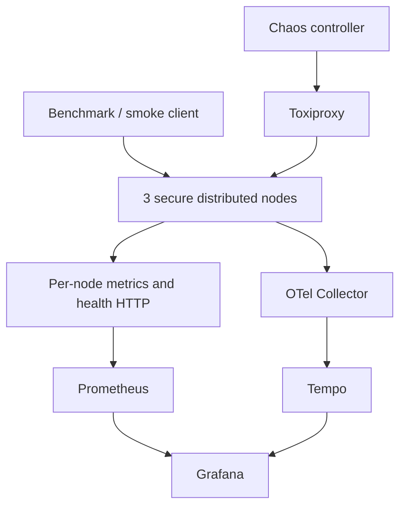

# Phase 6 Observability, Chaos, and Performance Design

## Status

Approved architecture direction: Prometheus metrics, OpenTelemetry tracing,
Grafana visualization, and Toxiproxy-based network chaos.

## Goal

Turn the Phase 5 secure persistent cluster into an observable, fault-tested
platform whose normal, overloaded, degraded, and recovering behavior can be
explained from reproducible evidence.

Phase 6 must demonstrate engineering maturity rather than headline benchmark
numbers. A reviewer must be able to reproduce a run, identify the injected
fault, correlate it with telemetry, and verify recovery against explicit
service-level objectives.

## Scope

Phase 6 includes:

- low-cardinality Prometheus metrics for request, cluster, replication,
  persistence, recovery, coordination, and runtime behavior;
- an HTTP observability server exposing `/metrics`, `/health/live`, and
  `/health/ready` on a port separate from the application protocol;
- OpenTelemetry spans propagated across client, node, peer, replication,
  persistence, and recovery boundaries;
- an OpenTelemetry Collector and Tempo trace backend;
- provisioned Prometheus and Grafana configuration;
- a version-controlled Grafana dashboard;
- deterministic node-kill, network-delay, network-partition, and etcd-outage
  experiments;
- a reproducible benchmark runner and machine-readable result artifact;
- correctness, observability, chaos, and performance release gates;
- documentation describing methodology, interpretation, and limitations.

Phase 6 does not include:

- production cloud deployment, Kubernetes, Helm, Terraform, or CI release
  automation, which remain Phase 7 work;
- Loki or a second log storage system;
- auto-scaling or automatic remediation;
- claims of linearizability, consensus, quorum durability, exactly-once
  processing, or distributed transactions;
- fixed throughput claims that ignore hardware and environment;
- destructive chaos against hosts or resources outside the dedicated Phase 6
  Docker Compose project.

## Design Principles

1. Observability must not change correctness semantics.
2. Telemetry failures must never stop the data plane.
3. Metric labels must have bounded cardinality. Keys, correlation IDs, causal
   tokens, exception messages, and arbitrary node-generated values are banned
   from metric labels.
4. Trace attributes may include correlation IDs and peer node IDs but never
   CRDT values, certificates, keys, secrets, or causal-token contents.
5. Chaos actions must be explicitly enabled, scoped, time-bounded, reversible,
   and followed by cleanup.
6. Benchmarks must report environment metadata and correctness failures along
   with latency and throughput.
7. Default settings must fit the user's 16 GB WSL development laptop.

## Architecture

Each distributed node keeps its framed TLS application listener and starts an
independent HTTP observability listener. Prometheus scrapes each node directly.
The application exports spans over OTLP to a local OpenTelemetry Collector,
which batches and forwards them to Tempo. Grafana reads metrics from Prometheus
and traces from Tempo.

Toxiproxy sits only in explicitly configured peer or etcd paths used by chaos
scenarios. The chaos controller calls the Toxiproxy HTTP API to add and remove
latency or disable a proxy. Node-kill scenarios send signals only to PIDs from
the Phase 6 runner's PID file. Every scenario records its start, end, expected
effect, observed effect, recovery duration, and cleanup result.

## Components and File Boundaries

### Observability package

`src/distsys/observability/metrics.py` owns metric definitions and a
`Metrics` facade. It uses a dedicated `CollectorRegistry` per process so tests
and multiple in-process nodes cannot collide in the default global registry.
Instrumentation calls are synchronous, non-blocking counter/gauge/histogram
updates.

`src/distsys/observability/health.py` owns the small asyncio HTTP server. It
serves only three GET routes:

- `/metrics`: Prometheus text exposition;
- `/health/live`: HTTP 200 when the process event loop is alive, otherwise the
  listener cannot respond;
- `/health/ready`: HTTP 200 only when `HealthSnapshot.readiness` is true, and
  HTTP 503 otherwise.

Health responses are JSON and include stable fields only: node ID, liveness,
readiness, coordination, cluster health, and recovery phase. They do not expose
paths, certificates, environment variables, exception traces, or credentials.

`src/distsys/observability/tracing.py` owns tracer-provider initialization,
OTLP exporter setup, W3C trace-context helpers, span naming, and a no-op mode.
Tracing is disabled by default and gracefully falls back to no-op behavior when
the collector is unavailable.

### Node integration

`DistributedNode` owns the observability lifecycle. It creates the registry,
starts the HTTP observability listener after configuration validation, updates
health and recovery gauges from existing state transitions, and shuts the
listener and tracer provider down without delaying normal termination beyond a
bounded flush timeout.

Instrumentation is added at existing boundaries rather than creating a second
execution path:

- `handle_message`: request count, inflight count, duration, result status;
- task routing: local/forwarded/no-route outcomes;
- peer clients: attempts, failures, duration, circuit-open events;
- CRDT service: mutations, reads, causal repair outcomes;
- replication: queue depth, retry exhaustion, sends, anti-entropy repairs;
- persistence: operation duration, queue depth, backpressure, failures;
- coordination: lease status, renewals, failures, outage duration;
- recovery: phase, reconciliation attempts, failures, and duration;
- membership: alive/suspect/dead member counts and gossip failures.

### Monitoring deployment

`deploy/monitoring/docker-compose.yml` runs Prometheus, Grafana, Tempo,
OpenTelemetry Collector, and Toxiproxy. Images are pinned to explicit versions.
Containers use named volumes only where state is useful, health checks, bounded
log rotation, and a dedicated Compose project/network.

Prometheus uses static targets for the three local node observability ports.
Grafana provisioning installs Prometheus and Tempo data sources automatically.
The dashboard is JSON committed to the repository and requires no manual UI
configuration.

## Configuration

New settings use environment variables and safe defaults:

| Setting | Default | Purpose |
| --- | ---: | --- |
| `OBSERVABILITY_ENABLED` | `false` | Starts the HTTP metrics/health listener |
| `OBSERVABILITY_HOST` | `127.0.0.1` | Listener address |
| `OBSERVABILITY_PORT` | `9100` | Per-node listener port; runners assign 9100–9102 |
| `METRICS_ENABLED` | `true` | Enables metric recording when observability is on |
| `TRACING_ENABLED` | `false` | Enables OpenTelemetry export |
| `OTEL_EXPORTER_OTLP_ENDPOINT` | `http://127.0.0.1:4318` | Collector HTTP endpoint |
| `OTEL_SERVICE_NAME` | `distsys-node` | Trace service name |
| `OTEL_TRACE_SAMPLE_RATIO` | `0.10` | Parent-based probability sampling |
| `OTEL_EXPORT_TIMEOUT_SECONDS` | `2.0` | Bounded exporter timeout |

The node validates ports, sample ratio `[0.0, 1.0]`, and positive timeouts.
Tests and local multi-node runners assign unique observability ports.

## Metrics Contract

All names use the `distsys_` prefix. Histograms use explicit buckets suitable
for local sub-second operations rather than library defaults.

| Metric | Type | Labels |
| --- | --- | --- |
| `distsys_requests_total` | Counter | `node_id`, `message_type`, `status` |
| `distsys_request_duration_seconds` | Histogram | `node_id`, `message_type` |
| `distsys_requests_inflight` | Gauge | `node_id` |
| `distsys_rate_limited_total` | Counter | `node_id` |
| `distsys_overloaded_total` | Counter | `node_id`, `component` |
| `distsys_members` | Gauge | `node_id`, `status` |
| `distsys_gossip_failures_total` | Counter | `node_id` |
| `distsys_peer_rpc_total` | Counter | `node_id`, `operation`, `status` |
| `distsys_peer_rpc_duration_seconds` | Histogram | `node_id`, `operation` |
| `distsys_replication_queue_depth` | Gauge | `node_id` |
| `distsys_replication_total` | Counter | `node_id`, `status` |
| `distsys_anti_entropy_repairs_total` | Counter | `node_id`, `result` |
| `distsys_causal_repairs_total` | Counter | `node_id`, `result` |
| `distsys_persistence_duration_seconds` | Histogram | `node_id`, `operation` |
| `distsys_persistence_failures_total` | Counter | `node_id`, `operation` |
| `distsys_recovery_phase` | Gauge | `node_id`, `phase` |
| `distsys_recovery_duration_seconds` | Histogram | `node_id`, `result` |
| `distsys_coordination_healthy` | Gauge | `node_id` |
| `distsys_coordination_failures_total` | Counter | `node_id`, `operation` |

The exact enumerated values for `message_type`, `status`, `component`,
`operation`, `result`, and `phase` are documented beside their metric
definitions and tested. Unknown values normalize to `other`.

## Tracing Contract

Primary span names:

- `distsys.request` for inbound application messages;
- `distsys.peer_rpc` for cluster and CRDT peer calls;
- `distsys.task.execute` for local task execution;
- `distsys.crdt.mutate` and `distsys.crdt.read`;
- `distsys.replication.send` and `distsys.anti_entropy.reconcile`;
- `distsys.persistence.operation`;
- `distsys.recovery.restore` and `distsys.recovery.reconcile`;
- `distsys.coordination.operation`.

Required attributes are bounded: `distsys.node.id`, `distsys.peer.id`,
`distsys.message.type`, `distsys.operation`, `distsys.status`, and
`distsys.forwarded`. Errors use OpenTelemetry status and exception recording.
The existing message correlation ID is attached to spans and JSON logs, not
metrics.

Phase 6 propagates W3C `traceparent` and optional `tracestate` in new protobuf
fields. Missing fields remain valid, preserving protocol compatibility with
earlier nodes. Generated Python and type-stub files are regenerated by the
existing `make proto` workflow.

## Grafana Dashboard

One provisioned dashboard, “Distributed System — Phase 6,” contains:

1. cluster overview and readiness;
2. request throughput, error ratio, p50/p95/p99 latency, and inflight work;
3. membership status and gossip failures;
4. replication queue, retries, causal repairs, and anti-entropy convergence;
5. persistence latency and failures;
6. coordination health and failures;
7. recovery phase and recovery duration;
8. resource/process panels available from Prometheus runtime metrics;
9. links from selected panels to Tempo traces.

Panels include descriptions explaining healthy and unhealthy interpretations.
Dashboard variables are limited to node ID and operation/message type.

## Chaos Model

`scripts/chaos.py` exposes named scenarios through a controlled CLI:

- `node-kill`: SIGKILL one managed node, verify service continuity, restart it,
  and verify convergence;
- `network-delay`: add a Toxiproxy latency toxic with bounded latency and
  jitter, verify latency/error telemetry, then remove it;
- `partition`: disable selected proxy paths, verify degraded behavior and
  preserved causal correctness, restore paths, and verify convergence;
- `etcd-outage`: stop only the Phase 6 etcd service, verify coordination
  degradation with data-plane continuity, restart etcd, and verify registration.

Safety requirements:

- chaos requires `RUN_CHAOS_TESTS=1`;
- targets must be present in the Phase 6 manifest/PID file;
- Docker operations must specify the Phase 6 Compose file and project name;
- every scenario has a maximum duration;
- signal and exit traps remove toxics, re-enable proxies, restart required
  services, and stop managed processes;
- cleanup is idempotent;
- a failed assertion never skips cleanup;
- tests never call unrestricted `docker system prune`, broad `pkill`, host
  firewall rules, or destructive filesystem commands.

## Benchmark Methodology

`scripts/benchmark.py` supports task and CRDT workloads with configurable
concurrency, warm-up, duration, payload size, read/write ratio, and random seed.
It uses monotonic high-resolution timing and bounded concurrency.

Every result contains:

- Git commit and dirty-tree flag;
- UTC timestamp;
- Python, OS, kernel, CPU, logical-core, and memory metadata;
- WSL/container detection;
- node count, TLS state, workload, duration, warm-up, concurrency, request
  count, payload size, and seed;
- successes, failures by normalized class, throughput, and p50/p95/p99/max;
- correctness assertions and whether the run is valid.

Results are written as JSON under an ignored `benchmark-results/` directory.
Console output is a concise summary. A run with correctness errors is invalid
even if throughput is high.

The default laptop profile uses one worker per node, concurrency 16, a
10-second warm-up, a 30-second measurement window, and no monitoring retention
beyond the local run. A quick CI profile uses shorter durations and checks only
generous regression budgets. Formal results use at least five independent runs
and report the median of run-level results with variability.

Phase 6 makes no universal performance claim. Budgets are regression guards,
not promises across hardware:

- successful request ratio at least 99% in the healthy quick profile;
- p95 below 500 ms for the local healthy quick profile;
- no correctness failures;
- recovery and convergence complete within scenario-specific bounded windows.

## Tests and Release Gates

Unit tests cover registry isolation, metric label normalization, histogram
recording, health route/status behavior, trace no-op/export configuration,
context propagation, configuration validation, benchmark percentile
calculation, result serialization, and chaos target validation/cleanup.

Integration tests verify metric changes for real requests, readiness transition
responses, trace propagation across a peer hop, Prometheus target health, and
Grafana/Tempo provisioning.

Chaos tests live under `tests/chaos/` and are skipped unless
`RUN_CHAOS_TESTS=1`. Performance tests live under `tests/performance/` and are
skipped unless `RUN_PERFORMANCE_TESTS=1`.

Make targets:

- `make phase6-monitoring-up` and `make phase6-monitoring-down`;
- `make phase6-observability-smoke`;
- `make phase6-chaos`;
- `make phase6-benchmark`;
- `make phase6-release-gate`, which runs quality, monitoring smoke, chaos, and
  the quick performance regression in that order with cleanup traps.

## Acceptance Criteria

Phase 6 is complete when:

1. `make quality` passes without requiring Docker or monitoring services.
2. Three secure nodes expose independent health and metrics endpoints.
3. Prometheus reports all node targets healthy.
4. Grafana starts with working Prometheus and Tempo data sources and the
   committed dashboard already loaded.
5. A cross-node request produces a connected distributed trace.
6. Dashboard panels visibly explain a normal run, overload, node kill, network
   delay/partition, recovery, and etcd outage.
7. Each chaos scenario proves the expected degradation and bounded recovery,
   then leaves no toxics or managed processes behind.
8. The healthy benchmark emits reproducible JSON metadata and meets the quick
   regression budgets without correctness failures.
9. Existing Phase 1–5 behavior and release gates remain green.
10. Documentation states the consistency guarantees, failure assumptions,
    benchmark limitations, and exact reproduction commands.

## Risks and Mitigations

- **Instrumentation overhead:** tracing is disabled by default, sampling is
  configurable, and benchmark reports whether telemetry was enabled.
- **Cardinality explosion:** label values are enumerated and tests reject or
  normalize unbounded values.
- **Event-loop blocking:** the health server is asyncio-native; exporters batch
  work and use bounded timeouts.
- **Telemetry outage affecting service:** exporter errors are logged and
  dropped; they never fail requests.
- **Chaos leakage:** every mutation is registered before application and
  reverted through idempotent `finally`/signal cleanup.
- **Laptop resource pressure:** no Loki, conservative retention, one worker per
  node, and quick profiles are defaults.
- **Misleading benchmark comparisons:** environment metadata and dirty-tree
  state travel with every result; invalid runs cannot be summarized as valid.

## Delivery Strategy

Implementation proceeds in independently testable slices:

1. configuration and metrics foundation;
2. health HTTP server and node lifecycle;
3. core request/cluster/CRDT/persistence instrumentation;
4. tracing and protobuf context propagation;
5. monitoring Compose topology and dashboard;
6. benchmark runner and methodology;
7. safe chaos controller and scenarios;
8. Phase 6 smoke/release gates and documentation.

Each slice uses test-first development and a focused commit. Phase 6 work must
occur on a new `phase/6-observability-chaos` branch created from the verified
`main` commit that contains Phase 5.
